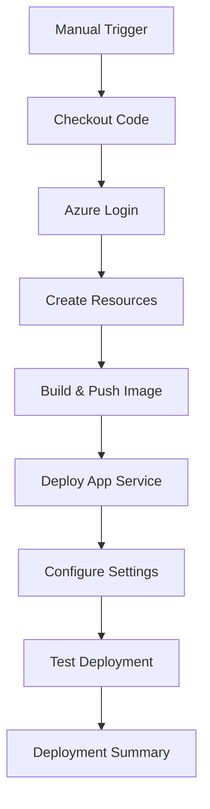

# GitHub Actions CI/CD

This repository includes automated GitHub Actions workflows for deploying to Azure and managing resources.

## 🚀 Workflows

### 1. Deploy to Azure (`deploy-azure.yml`)

Automated deployment workflow that creates Azure resources and deploys the FastAPI application.

**Trigger**: Manual workflow dispatch

**What it does**:
- ✅ Creates Azure Resource Group
- ✅ Creates Azure Container Registry (ACR) 
- ✅ Builds and pushes Docker image to ACR
- ✅ Creates App Service Plan (B1 Basic)
- ✅ Creates App Service with container deployment
- ✅ Configures environment variables
- ✅ Tests deployment and provides summary

### 2. Cleanup Azure Resources (`cleanup-azure.yml`)

Safe cleanup workflow for deleting Azure resources.

**Trigger**: Manual workflow dispatch with confirmation

**Safety Features**:
- Requires typing "DELETE" to confirm
- Lists resources before deletion
- Provides clear feedback

## ⚙️ Setup

### 1. Create Azure Service Principal

```bash
# Create service principal for GitHub Actions
az ad sp create-for-rbac \
  --name "github-actions-fastapi" \
  --role contributor \
  --scopes /subscriptions/{subscription-id} \
  --sdk-auth
```

Copy the JSON output for the next step.

### 2. Configure GitHub Secrets

Add these secrets to your GitHub repository (`Settings → Secrets and variables → Actions`):

#### Required Secrets

| Secret Name | Description | Example |
|-------------|-------------|---------|
| `AZURE_CREDENTIALS` | Service principal JSON from step 1 | `{"clientId": "...", "clientSecret": "...", ...}` |
| `MICROSOFT_APP_ID` | Azure Bot Framework App ID | `12345678-1234-1234-1234-123456789012` |
| `MICROSOFT_APP_PASSWORD` | Azure Bot Framework App Password | `your-bot-password` |
| `MICROSOFT_APP_TENANT_ID` | Azure AD Tenant ID | `87654321-4321-4321-4321-210987654321` |
| `AZURE_CLIENT_ID` | Azure AD App Registration Client ID | `11111111-2222-3333-4444-555555555555` |
| `AZURE_CLIENT_SECRET` | Azure AD App Registration Client Secret | `your-client-secret` |
| `AZURE_TENANT_ID` | Azure AD Tenant ID | `99999999-8888-7777-6666-555555555555` |

#### Secret Setup Commands

```bash
# Using GitHub CLI
gh secret set AZURE_CREDENTIALS --body "$(cat azure-credentials.json)"
gh secret set MICROSOFT_APP_ID --body "your-app-id"
gh secret set MICROSOFT_APP_PASSWORD --body "your-app-password"
# ... add other secrets
```

### 3. Environment Configuration

The workflows support multiple environments:

- **Production**: Default environment with full resources
- **Staging**: Alternative environment for testing

## 🎯 Usage

### Deploy to Azure

1. Go to **Actions** tab in your GitHub repository
2. Select **"Deploy to Azure"** workflow
3. Click **"Run workflow"**
4. Configure deployment options:
   - **Environment**: production or staging
   - **Resource Group**: Name for Azure resource group
   - **Location**: Azure region (eastus, westus2, etc.)
5. Click **"Run workflow"** to start deployment

### Monitor Deployment

- View real-time logs in the Actions tab
- Check deployment summary with URLs and costs
- Access application at provided URLs

### Cleanup Resources

1. Go to **Actions** tab in your GitHub repository  
2. Select **"Cleanup Azure Resources"** workflow
3. Click **"Run workflow"**
4. Enter resource group name to delete
5. **Type "DELETE" exactly** to confirm
6. Click **"Run workflow"** to start cleanup

## 📊 Deployment Outputs

After successful deployment, the workflow provides:

### Application URLs
- **Main App**: `https://app-fastapi-agent-{run-number}.azurewebsites.net`
- **Health Check**: `https://app-fastapi-agent-{run-number}.azurewebsites.net/health`
- **API Docs**: `https://app-fastapi-agent-{run-number}.azurewebsites.net/docs`

### Resource Information
- Resource Group name
- Container Registry details
- App Service details
- Estimated monthly costs

## 🔒 Security Best Practices

### Secrets Management
- Store all sensitive data in GitHub Secrets
- Use service principal with minimal required permissions
- Rotate secrets regularly
- Never commit secrets to repository

### Resource Security
- Resources are created with secure defaults
- HTTPS is enabled by default
- Container registry uses admin authentication
- App Service runs with managed identity when possible

## 🐛 Troubleshooting

### Common Issues

#### 1. Authentication Errors

**Error**: `AADSTS7000215: Invalid client secret`

**Solution**:
- Verify `AZURE_CREDENTIALS` secret is correctly formatted JSON
- Check service principal hasn't expired
- Regenerate service principal if needed

#### 2. Resource Name Conflicts

**Error**: `The specified name is already taken`

**Solution**:
- Resource names include run number for uniqueness
- If needed, delete existing resources first
- Use different resource group name

#### 3. Deployment Timeout

**Error**: Workflow times out during deployment

**Solution**:
- Check Azure service status
- Verify subscription has available quota
- Retry deployment

#### 4. Health Check Failures

**Error**: Health endpoint returns 404 or 500

**Solution**:
- Check application logs in Azure Portal
- Verify environment variables are set correctly
- Ensure container is starting properly

### Debug Commands

```bash
# Check resource status
az resource list --resource-group [rg-name] --output table

# View app service logs
az webapp log tail --name [app-name] --resource-group [rg-name]

# Test container locally
docker run -p 3978:3978 --env-file .env [image-name]
```

## 📈 Customization

### Modify Deployment Configuration

Edit `.github/workflows/deploy-azure.yml`:

```yaml
# Change App Service SKU
--sku S1  # Standard tier instead of B1

# Change ACR SKU  
--sku Standard  # Standard tier instead of Basic

# Add custom tags
--tags environment=production project=fastapi-agent
```

### Add Environment-Specific Settings

Create environment-specific workflows or use conditional settings:

```yaml
# In workflow file
- name: Set Environment Variables
  run: |
    if [ "${{ github.event.inputs.environment }}" == "staging" ]; then
      echo "Using staging configuration"
      # Set staging-specific variables
    else
      echo "Using production configuration"
      # Set production-specific variables
    fi
```

### Custom Notifications

Add notification steps to workflows:

```yaml
- name: Notify Teams
  if: always()
  uses: 8398a7/action-slack@v3
  with:
    status: ${{ job.status }}
    webhook_url: ${{ secrets.SLACK_WEBHOOK }}
```

## 📋 Workflow Files

| File | Purpose | Trigger |
|------|---------|---------|
| `deploy-azure.yml` | Deploy application to Azure | Manual |
| `cleanup-azure.yml` | Delete Azure resources | Manual |

## 🔄 CI/CD Pipeline Flow



## 🚀 Next Steps

1. **Set up automated triggers** based on git events
2. **Add integration tests** to validate deployments
3. **Implement blue-green deployments** for zero downtime
4. **Add monitoring and alerting** with Azure Monitor
5. **Configure custom domains** and SSL certificates

For local deployment alternatives, see the [deployment scripts](../deploy-to-azure.sh) in the root directory.
