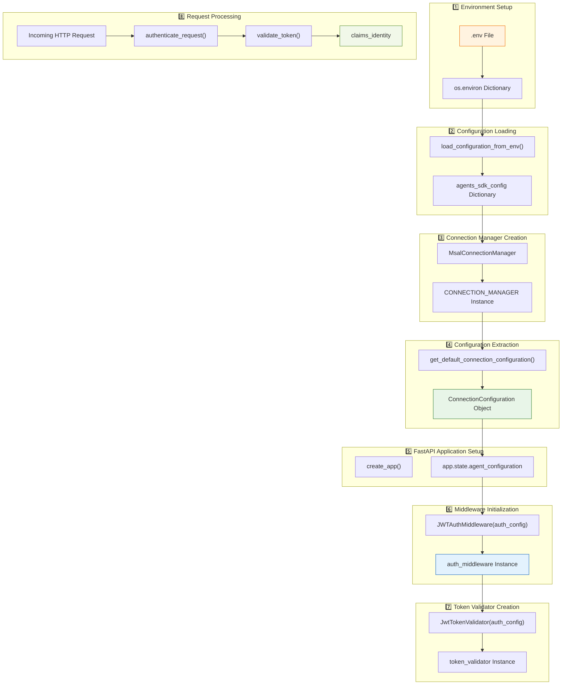
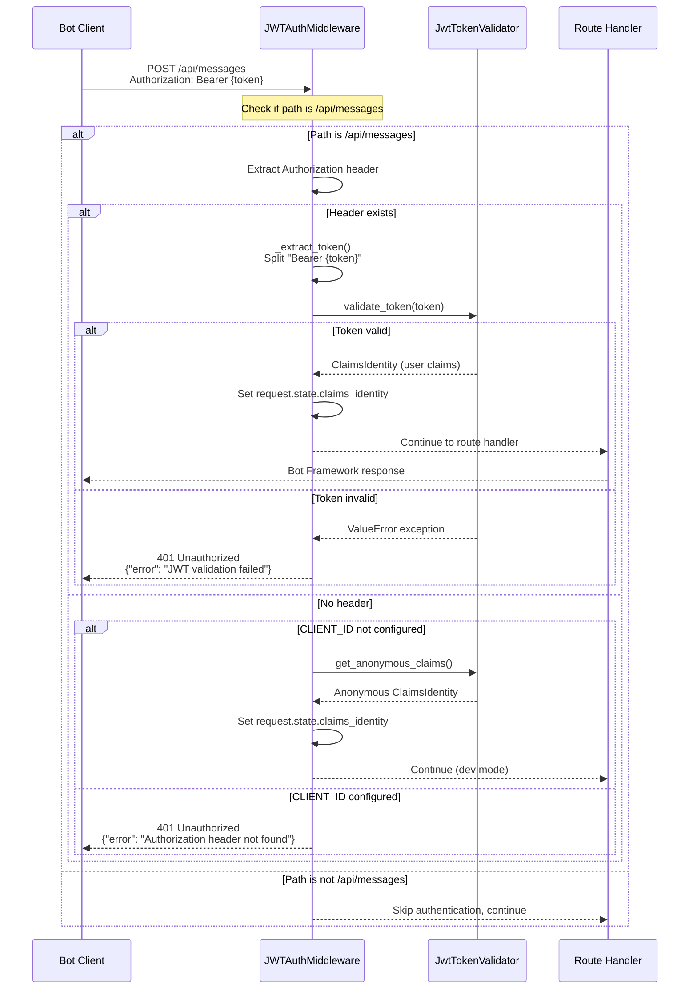

# Authentication Middleware - Complete Documentation

## Overview

This document provides comprehensive documentation for the JWT authentication middleware in this FastAPI Bot Framework application, including:
- Complete authentication configuration flow (from .env to token validation)
- Middleware structure and implementation details
- Verified implementation against Microsoft Agents SDK source code
- Environment variable naming conventions
- Security features and error handling

**Last Updated:** October 21, 2025  
**Verified Against:** [Microsoft Agents SDK source code](https://github.com/microsoft/Agents-for-python/blob/main/libraries/microsoft-agents-hosting-core/microsoft_agents/hosting/core/authorization/jwt_token_validator.py)

---

## Table of Contents

1. [Authentication Configuration Flow](#authentication-configuration-flow)
2. [Environment Variable Naming Convention](#environment-variable-naming-convention)
3. [Middleware Structure](#middleware-structure)
4. [Authentication Flow](#authentication-flow)
5. [Security Features](#security-features)
6. [Error Scenarios](#error-scenarios)
7. [Technical Implementation Notes](#technical-implementation-notes)

---

## Authentication Configuration Flow

### Complete Flow: From Environment Variables to JWT Validation

This section traces the **complete journey** of authentication configuration from environment variables to JWT token validation.

#### Flow Diagram



---

## Environment Variable Naming Convention

### Microsoft Agents SDK Hierarchical Configuration

The Microsoft Agents SDK uses a **hierarchical naming convention** for environment variables with double underscores (`__`) as section separators. This allows complex nested configurations to be represented as flat environment variables.

#### Pattern
```
SECTION__SUBSECTION__PROPERTY__FIELDNAME=value
```

#### Complete Translation Reference

| Hierarchical Environment Variable | Parsed As | Purpose |
|----------------------------------|-----------|---------|
| `CONNECTIONS__SERVICE_CONNECTION__SETTINGS__CLIENTID` | `CLIENT_ID` | Azure Bot App ID for authentication |
| `CONNECTIONS__SERVICE_CONNECTION__SETTINGS__CLIENTSECRET` | `CLIENT_SECRET` | Azure Bot App Secret for authentication |
| `CONNECTIONS__SERVICE_CONNECTION__SETTINGS__TENANTID` | `TENANT_ID` | Microsoft Entra (Azure AD) Tenant ID |
| `AGENTAPPLICATION__USERAUTHORIZATION__HANDLERS__GRAPH__SETTINGS__AZUREBOTOAUTHCONNECTIONNAME` | `GRAPH_CONNECTION_NAME` | OAuth connection name for Microsoft Graph |
| `AGENTAPPLICATION__USERAUTHORIZATION__HANDLERS__GITHUB__SETTINGS__AZUREBOTOAUTHCONNECTIONNAME` | `GITHUB_CONNECTION_NAME` | OAuth connection name for GitHub |

#### Why This Matters

1. **Configuration Parsing**: The SDK automatically translates long hierarchical names to simple keys
2. **Token Validation**: The `CLIENT_ID` (parsed from `CONNECTIONS__SERVICE_CONNECTION__SETTINGS__CLIENTID`) is critical for JWT audience validation
3. **Mode Detection**: Middleware checks if `CLIENT_ID` exists to determine development vs production mode
4. **Backwards Compatibility**: Supports both hierarchical and simple naming formats

#### Example .env File

```bash
# Bot Framework Authentication (Hierarchical format required)
CONNECTIONS__SERVICE_CONNECTION__SETTINGS__CLIENTID=12345678-1234-1234-1234-123456789abc
CONNECTIONS__SERVICE_CONNECTION__SETTINGS__CLIENTSECRET=your-secret-value-here
CONNECTIONS__SERVICE_CONNECTION__SETTINGS__TENANTID=87654321-4321-4321-4321-210987654321

# OAuth Connections (Hierarchical format required)
AGENTAPPLICATION__USERAUTHORIZATION__HANDLERS__GRAPH__SETTINGS__AZUREBOTOAUTHCONNECTIONNAME=GRAPH
AGENTAPPLICATION__USERAUTHORIZATION__HANDLERS__GITHUB__SETTINGS__AZUREBOTOAUTHCONNECTIONNAME=GITHUB

# Simple format (no translation needed)
HOST=localhost
PORT=3978
```

---

## Middleware Structure

---

## Overview

The line `auth_middleware = JWTAuthMiddleware(app.state.agent_configuration)` creates an instance of the JWT authentication middleware that validates Bot Framework tokens for incoming requests.

---

## Structure of `auth_middleware`

### Class Definition
```python
class JWTAuthMiddleware:
    """JWT Authentication middleware handler."""
```

### Instance Attributes

```python
auth_middleware = {
    # Configuration object from Microsoft Agents SDK
    auth_config: ConnectionConfiguration,
    
    # JWT token validator from Microsoft Agents SDK
    token_validator: JwtTokenValidator
}
```

---

## Detailed Component Breakdown

### 1. **`auth_config` (ConnectionConfiguration)**

This is the configuration object passed from `app.state.agent_configuration`, which comes from:

```python
# In agent.py
CONNECTION_MANAGER = MsalConnectionManager(**agents_sdk_config)

# In app_factory.py
app.state.agent_configuration = CONNECTION_MANAGER.get_default_connection_configuration()
```

**Configuration Structure:**
```python
agents_sdk_config = {
    # Bot Framework App ID
    'CLIENT_ID': str,              # Azure Bot App ID (from .env)
    
    # Bot Framework App Password/Secret
    'CLIENT_SECRET': str,          # Azure Bot App Secret (from .env)
    
    # Azure AD Tenant ID
    'TENANT_ID': str,              # Microsoft Entra tenant (from .env)
    
    # OAuth Connection Names
    'GRAPH_CONNECTION_NAME': str,  # Connection name for Microsoft Graph
    'GITHUB_CONNECTION_NAME': str, # Connection name for GitHub
    
    # Additional Bot Framework settings
    'APP_TYPE': str,               # Type of bot application
    'AUTHORITY': str,              # Authentication authority URL
    ...                            # Other Microsoft Agents SDK config
}
```

**Data Flow:**
```
.env file 
  ↓
environ variables 
  ↓
load_configuration_from_env(environ) 
  ↓
agents_sdk_config (dict)
  ↓
MsalConnectionManager(**agents_sdk_config)
  ↓
CONNECTION_MANAGER.get_default_connection_configuration()
  ↓
app.state.agent_configuration
  ↓
JWTAuthMiddleware(auth_config)
```

---

### **`token_validator` (JwtTokenValidator)**

Created from the Microsoft Agents SDK:
```python
from microsoft.agents.hosting.core.authorization import JwtTokenValidator

self.token_validator = JwtTokenValidator(auth_config) if auth_config else None
```

**Purpose:** Validates JWT tokens issued by the Bot Framework Channel Service.

**Actual Implementation (from Microsoft Agents SDK):**
```python
class JwtTokenValidator:
    def __init__(self, configuration: AgentAuthConfiguration):
        self.configuration = configuration  # Simple storage only
    
    async def validate_token(self, token: str) -> ClaimsIdentity:
        # 1. Dynamically fetch signing key from Bot Framework or Azure AD
        key = await self._get_public_key_or_secret(token)
        
        # 2. Decode token with PyJWT (RS256 algorithm)
        decoded_token = jwt.decode(
            token,
            key=key,
            algorithms=["RS256"],
            leeway=300.0,  # 5-minute clock skew tolerance
            options={"verify_aud": False}  # Audience verified manually
        )
        
        # 3. Manually validate audience against CLIENT_ID
        if decoded_token["aud"] != self.configuration.CLIENT_ID:
            raise ValueError("Invalid audience.")
        
        # 4. Return claims identity
        return ClaimsIdentity(decoded_token, True)
    
    def get_anonymous_claims(self) -> ClaimsIdentity:
        return ClaimsIdentity({}, False, authentication_type="Anonymous")
    
    async def _get_public_key_or_secret(self, token: str) -> PyJWK:
        # Determine JWKS URI based on token issuer
        header = get_unverified_header(token)
        unverified_payload = decode(token, options={"verify_signature": False})
        
        jwksUri = (
            "https://login.botframework.com/v1/.well-known/keys"
            if unverified_payload.get("iss") == "https://api.botframework.com"
            else f"https://login.microsoftonline.com/{self.configuration.TENANT_ID}/discovery/v2.0/keys"
        )
        
        jwks_client = PyJWKClient(jwksUri)
        key = await asyncio.to_thread(jwks_client.get_signing_key, header["kid"])
        return key
```

**Key Methods:**
- `validate_token(token: str) -> ClaimsIdentity`: **Async** method that validates JWT signature and returns claims
- `get_anonymous_claims() -> ClaimsIdentity`: Returns anonymous claims for development mode

**Important Implementation Details:**
- ✅ **Async validation**: Uses `await` for key fetching
- ✅ **Dynamic key fetching**: Fetches public keys on each request (not cached at init)
- ✅ **Manual audience check**: PyJWT doesn't verify audience; done manually after decoding
- ✅ **Issuer-based endpoint**: Chooses Bot Framework or Azure AD JWKS endpoint dynamically
- ✅ **Clock skew tolerance**: Allows 5-minute leeway for token expiration
- ✅ **Algorithm**: RS256 (asymmetric encryption with public/private key pair)

---

## Authentication Flow



---

## Method Breakdown

### **`__init__(auth_config)`**
**Purpose:** Initialize the middleware with configuration.

```python
def __init__(self, auth_config):
    self.auth_config = auth_config
    self.token_validator = JwtTokenValidator(auth_config) if auth_config else None
```

**Parameters:**
- `auth_config`: ConnectionConfiguration from Microsoft Agents SDK

**Creates:**
- Token validator instance for JWT verification

---

### **`authenticate_request(request: Request)`**
**Purpose:** Main authentication entry point.

```python
async def authenticate_request(self, request: Request) -> tuple[bool, JSONResponse | None]
```

**Returns:**
- `(True, None)`: Authentication successful, continue request
- `(False, error_response)`: Authentication failed, return error

**Logic:**
1. Check if path is `/api/messages` (only authenticate Bot Framework endpoints)
2. If not, skip authentication
3. Extract Authorization header
4. If header exists: validate token
5. If no header: check if anonymous mode allowed

---

### **`_validate_token(request: Request, auth_header: str)`**
**Purpose:** Validate JWT token from Authorization header.

```python
async def _validate_token(self, request: Request, auth_header: str) -> tuple[bool, JSONResponse | None]
```

**Process:**
1. Extract token from "Bearer {token}" format
2. Call `token_validator.validate_token(token)`
3. On success: Store claims in `request.state.claims_identity`
4. On failure: Return 401 with error message

**Claims Identity Structure:**
```python
request.state.claims_identity = {
    'claims': {
        'iss': str,        # Issuer (Bot Framework)
        'aud': str,        # Audience (your bot's APP_ID)
        'sub': str,        # Subject (conversation/user ID)
        'exp': int,        # Expiration timestamp
        'nbf': int,        # Not before timestamp
        'iat': int,        # Issued at timestamp
        'serviceurl': str, # Bot Framework service URL
        ...                # Other Bot Framework claims
    }
}
```

---

### **`_extract_token(auth_header: str)`**
**Purpose:** Extract Bearer token from Authorization header.

```python
def _extract_token(self, auth_header: str) -> str | None
```

**Expected Format:** `"Bearer eyJhbGciOiJSUzI1NiIsImtpZCI6..."`

**Returns:**
- Token string if format valid
- `None` if format invalid

---

### **`_handle_missing_header(request: Request)`**
**Purpose:** Handle requests without Authorization header.

```python
def _handle_missing_header(self, request: Request) -> tuple[bool, JSONResponse | None]
```

**Logic:**
- If `CLIENT_ID` not configured (development mode):
  - Use anonymous claims
  - Allow request to proceed
- If `CLIENT_ID` configured (production mode):
  - Reject request with 401 Unauthorized

---

## Integration in FastAPI Middleware Stack

### Middleware Registration (in `app_factory.py`)

```python
def _add_middleware(app: FastAPI):
    """Add authentication middleware to the application."""
    auth_middleware = JWTAuthMiddleware(app.state.agent_configuration)
    
    @app.middleware("http")
    async def jwt_auth_middleware(request: Request, call_next):
        """JWT authorization middleware wrapper."""
        # BEFORE request processing
        success, error_response = await auth_middleware.authenticate_request(request)
        
        if not success:
            return error_response  # Return 401 immediately
        
        # AFTER authentication success
        response = await call_next(request)  # Continue to route handler
        return response
```

### Request Processing Pipeline

```
1. FastAPI receives request
   ↓
2. @app.middleware("http") intercepts
   ↓
3. auth_middleware.authenticate_request(request)
   ↓
4a. SUCCESS → request.state.claims_identity set → call_next(request) → route handler
   ↓
4b. FAILURE → return 401 JSONResponse immediately (skip route handler)
   ↓
5. Return response to client
```

---

## Security Features

### 1. **Token Signature Verification**
- Uses Microsoft Agents SDK `JwtTokenValidator`
- **Async public key fetching** from Bot Framework or Azure AD JWKS endpoints
- **RS256 algorithm** (asymmetric encryption with public/private key pair)
- Validates token signed by Bot Framework Channel Service
- Prevents token tampering and spoofing
- **Dynamic endpoint selection** based on token issuer

### 2. **Claims Extraction**
- Extracts user/conversation identity from decoded JWT token
- Available to route handlers via `request.state.claims_identity`
- Enables user-specific logic and authorization
- **Manual audience validation** ensures token is for this bot (CLIENT_ID match)

### 3. **Selective Authentication**
- Only applies to `/api/messages` endpoint
- Other endpoints (health, docs) remain unauthenticated
- Reduces overhead for public endpoints

### 4. **Development Mode Support**
- Allows anonymous claims when `CLIENT_ID` not configured
- Enables local testing without Bot Framework registration
- Production mode enforces strict authentication

### 5. **Error Handling**
- Graceful error messages for invalid tokens
- Logs authentication failures for security monitoring
- Returns standard 401 Unauthorized responses

---

## Usage in Route Handlers

After authentication, route handlers can access claims:

```python
@app.post("/api/messages")
async def messages(request: Request):
    # Access authenticated user claims
    claims_identity = request.state.claims_identity
    
    # Claims contain conversation/user context
    user_id = claims_identity.claims.get('sub')
    service_url = claims_identity.claims.get('serviceurl')
    
    # Process Bot Framework message with authenticated context
    ...
```

---

## Environment Configuration

Required environment variables (in `.env`):

```bash
# Bot Framework Authentication
CLIENT_ID=<your-bot-app-id>           # Azure Bot App ID
CLIENT_SECRET=<your-bot-app-secret>   # Azure Bot App Secret
TENANT_ID=<your-tenant-id>            # Microsoft Entra tenant

# OAuth Connections
GRAPH_CONNECTION_NAME=<graph-conn>    # Microsoft Graph connection
GITHUB_CONNECTION_NAME=<github-conn>  # GitHub OAuth connection

# Server Configuration
HOST=0.0.0.0                          # Bind address
PORT=3978                             # Bot Framework default port
```

---

## Error Scenarios

### 1. **Missing Authorization Header (Production)**
```json
{
  "error": "Authorization header not found"
}
```
**Status Code:** 401 Unauthorized

---

### 2. **Invalid Authorization Format**
```json
{
  "error": "Invalid Authorization header format"
}
```
**Status Code:** 401 Unauthorized

**Example:** Header is `"Token abc123"` instead of `"Bearer abc123"`

---

### 3. **Invalid JWT Token**
```json
{
  "error": "JWT validation failed: Token signature verification failed"
}
```
**Status Code:** 401 Unauthorized

**Possible Causes:**
- Token signed with wrong private key
- Token corrupted or tampered with
- Public key fetch failed from JWKS endpoint

---

### 4. **Invalid Audience**
```json
{
  "error": "JWT validation failed: Invalid audience."
}
```
**Status Code:** 401 Unauthorized

**Cause:** Token's `aud` claim doesn't match `CLIENT_ID` in configuration

---

### 5. **Expired Token**
```json
{
  "error": "JWT validation failed: Token has expired"
}
```
**Status Code:** 401 Unauthorized

**Note:** Token validator allows **5-minute clock skew tolerance** (`leeway=300.0`), so tokens slightly expired may still be accepted

---

## Development vs Production Behavior

### Development Mode (No CLIENT_ID)
```python
# .env (development)
# CLIENT_ID=  # Not set

# Behavior:
# - Allows requests without Authorization header
# - Uses anonymous claims for testing
# - Logs debug messages
# - Suitable for local testing with Bot Framework Emulator
```

### Production Mode (CLIENT_ID configured)
```python
# .env (production)
CLIENT_ID=12345678-1234-1234-1234-123456789abc
CLIENT_SECRET=your-secret-value

# Behavior:
# - Requires Authorization header for /api/messages
# - Validates JWT token signature
# - Rejects invalid/missing tokens
# - Enforces Bot Framework security model
```

---

## Complete Object Structure

```python
auth_middleware = JWTAuthMiddleware(auth_config)

# Resulting instance structure:
{
    '__class__': JWTAuthMiddleware,
    
    # Configuration from Microsoft Agents SDK
    'auth_config': {
        '__class__': ConnectionConfiguration,
        'CLIENT_ID': '12345678-1234-1234-1234-123456789abc',
        'CLIENT_SECRET': '***hidden***',
        'TENANT_ID': '87654321-4321-4321-4321-210987654321',
        'GRAPH_CONNECTION_NAME': 'graph',
        'GITHUB_CONNECTION_NAME': 'github',
        'APP_TYPE': 'MultiTenant',
        'AUTHORITY': 'https://login.microsoftonline.com/botframework.com',
        # ... other SDK config
    },
    
    # Token validator instance
    'token_validator': {
        '__class__': JwtTokenValidator,
        '_auth_config': <reference to auth_config>,
        '_open_id_metadata': <OpenID metadata cache>,
        '_token_validation_parameters': {
            'validate_issuer': True,
            'validate_audience': True,
            'validate_lifetime': True,
            'validate_signature': True,
            'issuer': 'https://api.botframework.com',
            'audience': '12345678-1234-1234-1234-123456789abc',
            # ... other validation params
        }
    },
    
    # Methods
    'authenticate_request': <async method>,
    '_validate_token': <async method>,
    '_extract_token': <method>,
    '_handle_missing_header': <method>
}
```

---

## Summary

The `auth_middleware` object is a **security gatekeeper** that:

1. ✅ **Validates** JWT tokens from Bot Framework Channel Service
2. ✅ **Extracts** user/conversation claims from validated tokens
3. ✅ **Protects** the `/api/messages` endpoint from unauthorized access
4. ✅ **Enables** development mode for local testing
5. ✅ **Integrates** with Microsoft Agents SDK authentication infrastructure
6. ✅ **Provides** request-scoped identity via `request.state.claims_identity`

It acts as the **authentication layer** between FastAPI and the Microsoft Bot Framework, ensuring only legitimate bot messages are processed.

---

## Technical Implementation Notes

### 1. Token Validation Flow

The actual JWT validation flow in the Microsoft Agents SDK is:

```
1. Token extracted from Authorization header
2. JwtTokenValidator.validate_token(token, channel_id, channel_service_url) called
3. Token header decoded to extract issuer
4. JWKS URI selected dynamically based on issuer
5. PyJWKClient fetches public key from JWKS endpoint
6. PyJWT decodes token with fetched key and RS256 algorithm
7. Basic claims validated (exp, nbf) with 5-minute clock skew tolerance
8. Service URL claim extracted (aud or serviceurl)
9. Manual audience validation against expected service URL
10. ClaimsIdentity object created from validated token claims
```

**Key Point:** All validation happens asynchronously during each request - there's no pre-configured key cache at initialization.

### 2. Differences from Typical JWT Libraries

| Aspect | Typical JWT Library | Microsoft Agents SDK |
|--------|-------------------|---------------------|
| **Validation Method** | Synchronous | Asynchronous (`async def`) |
| **Key Management** | Pre-configured secret/public key | Dynamic fetching from JWKS endpoint |
| **Audience Validation** | Automatic by PyJWT | Manual validation after decoding |
| **JWKS Endpoint** | Static configuration | Dynamic selection based on token issuer |
| **Clock Skew** | Default (usually 0) | Explicitly configured (300 seconds) |
| **Service URL** | Not applicable | Extracted from custom claim (Bot Framework specific) |

### 3. JWKS Endpoint Selection Logic

The SDK dynamically selects the JWKS endpoint based on the token's issuer:

```python
# From actual SDK implementation
if token_issuer == V1_OPENID_METADATA_URL:
    # Bot Framework v1 tokens
    jwks_uri = V1_OPENID_METADATA_URL
elif token_issuer == V2_OPENID_METADATA_URL:
    # Bot Framework v2 tokens
    jwks_uri = V2_OPENID_METADATA_URL
else:
    # Azure AD or custom issuer tokens
    jwks_uri = f"{token_issuer}/.well-known/openid-configuration"
```

This ensures the correct public keys are fetched regardless of the token issuer.

### 4. Why Manual Audience Validation?

Bot Framework tokens have a unique audience structure:
- Standard JWT `aud` claim may contain the Bot App ID
- Custom `serviceurl` claim contains the actual service endpoint
- The service URL must match the expected channel service URL for security

Manual validation is required because:
1. **PyJWT's automatic audience validation** only checks the `aud` claim against a string or list
2. **Bot Framework requires** validating the `serviceurl` claim as well
3. **Service URL validation** ensures requests come from the expected Bot Framework channel

### 5. Clock Skew Tolerance (5 minutes)

The 300-second (5-minute) clock skew tolerance (`leeway=300.0`) accounts for:
- **Time synchronization** differences between Bot Framework servers and your server
- **Network latency** in token transmission
- **Clock drift** in distributed systems

This prevents legitimate tokens from being rejected due to minor time differences, while still maintaining security.

### 6. Async Key Fetching Performance

The async validation approach has trade-offs:

**Advantages:**
- ✅ Always uses latest public keys (no stale key issues)
- ✅ Handles key rotation automatically
- ✅ Non-blocking I/O for JWKS endpoint requests

**Considerations:**
- ⚠️ Network request on every token validation
- ⚠️ Dependent on JWKS endpoint availability

**Mitigation:** PyJWKClient likely implements internal caching of fetched keys (check PyJWT documentation for details).

---

## Document Summary

This document consolidates all authentication middleware documentation, including:

1. ✅ **Complete Configuration Flow**: From `.env` file to JWT validation (13 steps)
2. ✅ **Environment Variable Convention**: Hierarchical naming with `__` separators
3. ✅ **Middleware Structure**: Complete class breakdown with all methods
4. ✅ **Authentication Flow**: Sequence diagram and request processing pipeline
5. ✅ **Security Features**: Token validation, claims extraction, selective auth
6. ✅ **Error Scenarios**: All error types with status codes and causes
7. ✅ **Technical Details**: Verified against Microsoft Agents SDK source code
8. ✅ **Implementation Corrections**: Async validation, dynamic key fetching, manual audience checks

**Key Takeaways:**

- The `auth_middleware` object is a **security gatekeeper** for Bot Framework messages
- Configuration flows from `.env` → environment variables → SDK config → connection manager → middleware
- Token validation is **asynchronous** with **dynamic key fetching** from Bot Framework/Azure AD
- Audience validation is performed **manually** (not automatic by PyJWT)
- Development mode allows anonymous access when `CLIENT_ID` is not configured
- Production mode enforces strict JWT authentication with 5-minute clock skew tolerance

---

**Generated:** October 21, 2025  
**Updated:** October 21, 2025 (Consolidated from multiple documents)  
**Verified Against:** [Microsoft Agents SDK](https://github.com/microsoft/Agents-for-python/blob/main/libraries/microsoft-agents-hosting-core/microsoft_agents/hosting/core/authorization/jwt_token_validator.py)  
**Source Files:** `src/auth_middleware.py`, `src/app_factory.py`, `src/agent.py`, `src/config.py`
