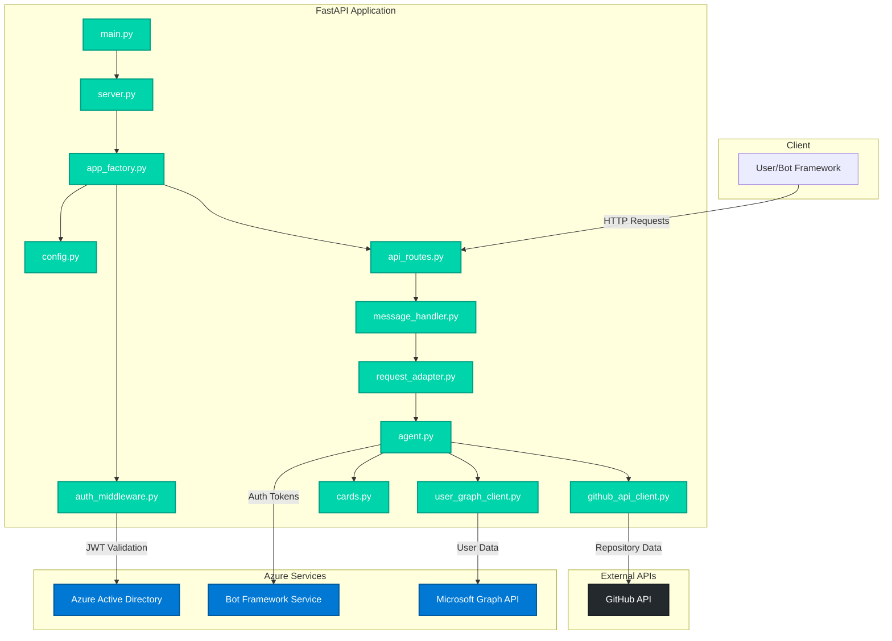
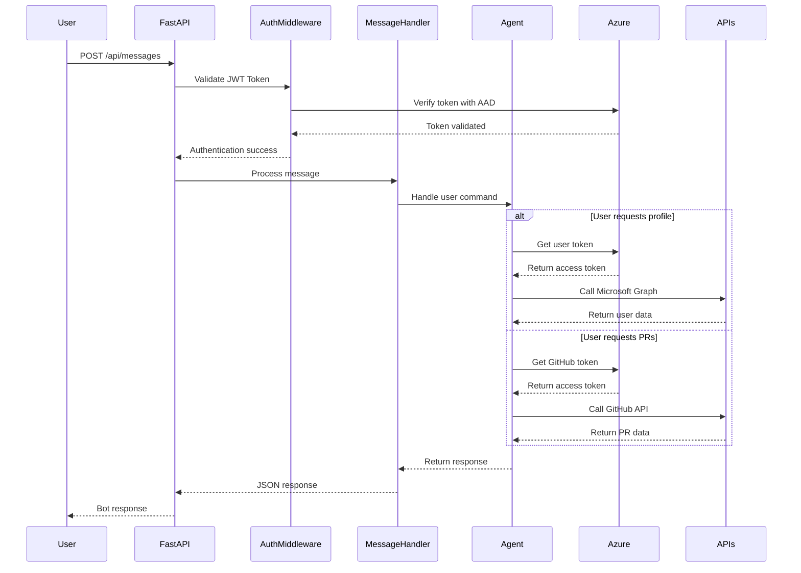

# FastAPI Auto Sign-In Agent

A Microsoft Agents SDK-powered FastAPI application that provides automated sign-in capabilities for Microsoft Graph and GitHub APIs. This application demonstrates clean architecture principles with modular design and SOLID principles.

## 🏗️ Architecture Overview



## 🛠️ Prerequisites

- **Python 3.8+**
- **Azure Active Directory App Registration**
- **Bot Framework Registration**
- **Microsoft Graph API permissions**
- **GitHub OAuth App (optional)**

## 📋 Azure Service Dependencies

This application integrates with the following Azure services:

### 🔐 Azure Active Directory (AAD)
- **Purpose**: Authentication and authorization
- **Configuration**: Client ID, Client Secret, Tenant ID
- **Permissions Required**:
  - `User.Read` (Microsoft Graph)
  - `openid`, `profile`, `email`

### 🤖 Azure Bot Service
- **Purpose**: Bot Framework integration
- **Configuration**: Bot registration and channels
- **Features**: WebChat channel, Direct Line API

### 📊 Microsoft Graph API
- **Purpose**: Access user profile and organizational data
- **Endpoints Used**:
  - `/me` - User profile information
  - `/me/photo` - User profile photos

## 🚀 Getting Started

### 1. Clone the Repository

```bash
git clone <repository-url>
cd fastapi-auto-signin-agent
```

### 2. Create Python Virtual Environment

#### Windows (PowerShell)
```powershell
# Create virtual environment
python -m venv venv

# Activate virtual environment
.\venv\Scripts\Activate.ps1

# Verify activation (should show venv path)
Get-Command python
```

#### Windows (Command Prompt)
```cmd
# Create virtual environment
python -m venv venv

# Activate virtual environment
venv\Scripts\activate.bat
```

#### macOS/Linux
```bash
# Create virtual environment
python3 -m venv venv

# Activate virtual environment
source venv/bin/activate
```

### 3. Install Dependencies

```bash
# Install required packages
pip install -r requirements.txt

# Verify installation
pip list
```

#### Key Dependencies

- **FastAPI**: Modern web framework for building APIs
- **Uvicorn**: ASGI server for running FastAPI applications  
- **Microsoft Agents SDK**: Core packages for bot functionality
  - `microsoft-agents-activity`: Activity processing
  - `microsoft-agents-hosting-core`: Core hosting functionality
  - `microsoft-agents-hosting-aiohttp`: aiohttp integration
  - `microsoft-agents-authentication-msal`: MSAL authentication
- **aiohttp**: HTTP client for external API calls
- **python-dotenv**: Environment variable loading

### 4. Configure Environment Variables

```bash
# Copy environment template
cp env.TEMPLATE .env

# Edit .env file with your Azure credentials
```

### 5. Configure Azure Services

#### Azure AD App Registration
1. Go to [Azure Portal](https://portal.azure.com)
2. Navigate to **Azure Active Directory** > **App registrations**
3. Create new registration or use existing
4. Note down: `Client ID`, `Client Secret`, `Tenant ID`
5. Configure redirect URIs for your bot

#### Bot Framework Registration
1. Go to [Azure Portal](https://portal.azure.com)
2. Create **Azure Bot** resource
3. Configure channels (Web Chat, Teams, etc.)
4. Set messaging endpoint: `https://your-domain.com/api/messages`

### 6. Environment Variables Configuration

Update your `.env` file:

```env
# Azure AD Configuration
CONNECTIONS__SERVICE_CONNECTION__SETTINGS__CLIENTID=your-client-id
CONNECTIONS__SERVICE_CONNECTION__SETTINGS__CLIENTSECRET=your-client-secret
CONNECTIONS__SERVICE_CONNECTION__SETTINGS__TENANTID=your-tenant-id

# Microsoft Graph Connection
AGENTAPPLICATION__USERAUTHORIZATION__HANDLERS__GRAPH__SETTINGS__AZUREBOTOAUTHCONNECTIONNAME=GRAPH

# GitHub Connection (optional)
AGENTAPPLICATION__USERAUTHORIZATION__HANDLERS__GITHUB__SETTINGS__AZUREBOTOAUTHCONNECTIONNAME=GITHUB

# Server Configuration
HOST=localhost
PORT=3978
```

## 🏃‍♂️ Running the Application

### Development Mode
```bash
# Activate virtual environment first
# Windows: .\venv\Scripts\Activate.ps1
# macOS/Linux: source venv/bin/activate

# Start the application
python main.py
```

### Production Mode
```bash
# Start the application (recommended)
python main.py

# Alternative: Using uvicorn with app factory (for deployment)
uvicorn src.app_factory:create_app --factory --host 0.0.0.0 --port 3978
```

**Note**: For external deployment platforms, you can use the `create_app` factory function from `src.app_factory` to get a configured FastAPI instance.

The server will start at: `http://localhost:3978`

## 📡 API Endpoints

| Endpoint | Method | Description |
|----------|---------|-------------|
| `/` | GET | Root endpoint with service info |
| `/health` | GET | Health check endpoint |
| `/api/messages` | POST | Bot Framework message endpoint |
| `/docs` | GET | FastAPI interactive documentation |
| `/redoc` | GET | ReDoc API documentation |

## 🤖 Bot Commands

The application supports the following bot commands when interacting through Bot Framework:

| Command | Description | Authentication Required |
|---------|-------------|------------------------|
| `/status`, `/auth status`, `/check status` | Check authentication status for Graph and GitHub | None |
| `/logout` | Sign out from all authentication handlers | None |
| `/me`, `/profile` | Get user profile from Microsoft Graph | Microsoft Graph |
| `/prs`, `/pull requests` | Get pull requests from GitHub (octocat/Hello-World repo) | GitHub |

### Usage Examples

```text
User: /status
Bot: Welcome to the FastAPI auto-signin demo
     Graph status: Connected
     GitHub status: Not connected

User: /me  
Bot: [Displays user profile card with Microsoft Graph data]

User: /prs
Bot: [Displays GitHub profile and recent pull requests]
```

## 🧪 Testing the Application

### 1. Health Check
```bash
curl http://localhost:3978/health
```

### 2. Root Endpoint
```bash
curl http://localhost:3978/
```

### 3. Interactive Documentation
Open in browser: `http://localhost:3978/docs`

## 🔄 Application Flow



## 📁 Project Structure

```text
fastapi-auto-signin-agent/
├── main.py                 # 🎯 Single entry point
├── requirements.txt        # 📦 Python dependencies  
├── .env                   # 🔐 Environment variables (create from template)
├── .gitignore            # 🚫 Git ignore patterns
├── env.TEMPLATE          # 📝 Environment template
└── src/
    ├── config.py         # ⚙️ Configuration management (46 lines)
    ├── server.py         # 🚀 Server startup (26 lines)
    ├── app_factory.py    # 🏭 FastAPI app factory (68 lines)
    ├── api_routes.py     # 🛣️ API route definitions (38 lines)
    ├── auth_middleware.py # 🔒 JWT authentication (89 lines)
    ├── message_handler.py # 📝 Message processing (93 lines)
    ├── request_adapter.py # 🔄 FastAPI/aiohttp bridge (100 lines)
    ├── agent.py          # 🤖 Bot agent logic (140 lines)
    ├── github_api_client.py # 🐙 GitHub integration (56 lines)
    ├── user_graph_client.py # 📊 Microsoft Graph integration (17 lines)
    ├── cards.py          # 🃏 Adaptive card templates (100 lines)
    └── __pycache__/      # 🗂️ Python bytecode cache
```

## 🔧 Development

### Code Style

- Follows **SOLID principles**
- Most files under **100 lines** (agent.py: 140 lines, cards.py: 100 lines)  
- **Clean architecture** with separation of concerns
- **Type hints** for better code quality

### Adding New Features

1. Create new module in `src/`
2. Update `app_factory.py` if needed
3. Add routes to `api_routes.py`
4. Update tests and documentation

## 🐛 Troubleshooting

### Common Issues

1. **Port already in use**
   ```bash
   # Change port in .env file
   PORT=3979
   ```

2. **Authentication errors**
   - Verify Azure AD app registration
   - Check client ID/secret in .env
   - Ensure proper permissions granted

3. **Module import errors**
   ```bash
   # Ensure virtual environment is activated
   # Reinstall dependencies
   pip install -r requirements.txt
   ```

### Logs
Check application logs for detailed error information:
```bash
python main.py 2>&1 | tee app.log
```

## 📚 Documentation

- **FastAPI Docs**: Available at `/docs` when running
- **Microsoft Agents SDK**: [Official Documentation](https://docs.microsoft.com/en-us/azure/bot-service/)
- **Azure AD**: [App Registration Guide](https://docs.microsoft.com/en-us/azure/active-directory/develop/)

## 🤝 Contributing

1. Fork the repository
2. Create feature branch: `git checkout -b feature/new-feature`
3. Make changes following code style guidelines
4. Add tests for new functionality
5. Submit pull request

## 📜 License

Copyright (c) Microsoft Corporation. All rights reserved.
Licensed under the MIT License.
