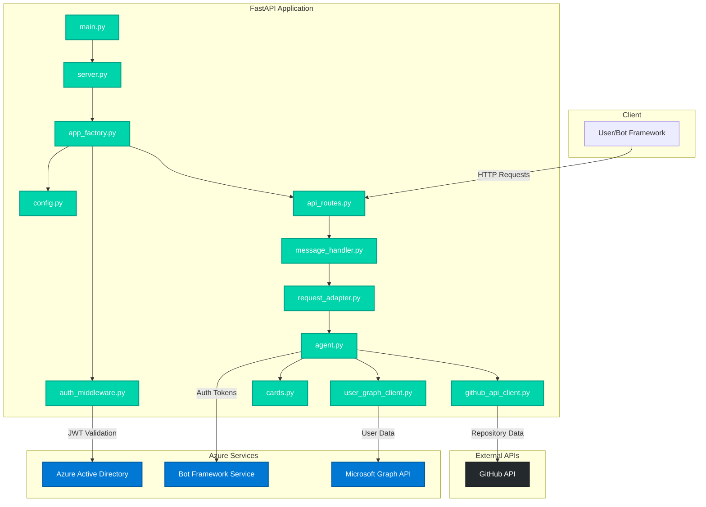
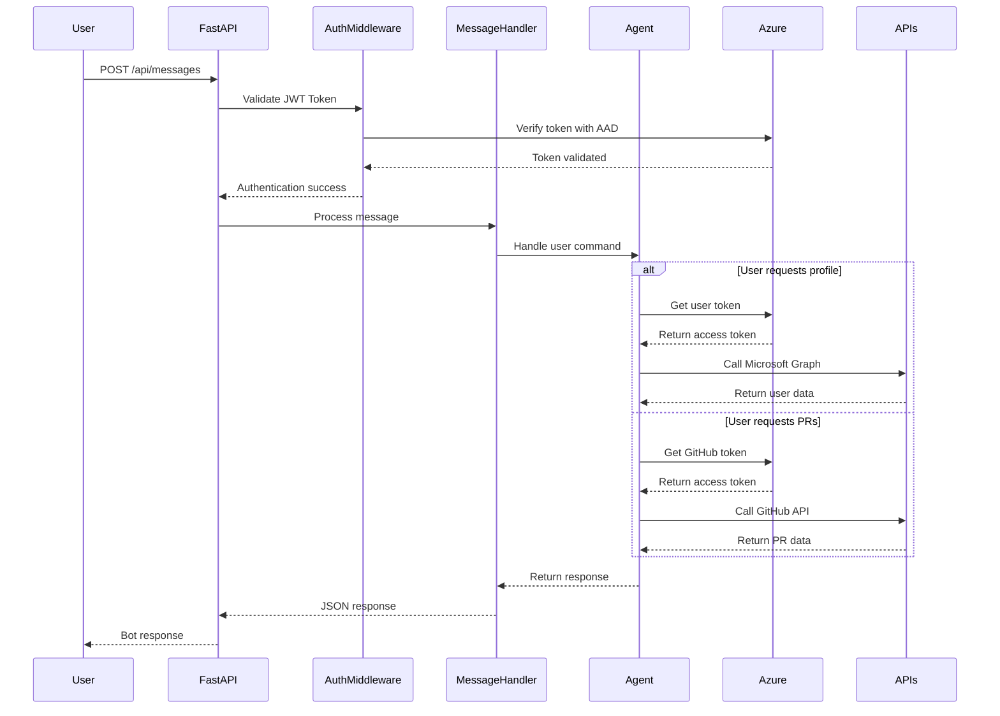

# FastAPI Auto Sign-In Agent

A Microsoft Agents SDK-powered FastAPI application that provides automated sign-in capabilities for Microsoft Graph and GitHub APIs. This application demonstrates clean architecture principles with modular design and SOLID principles.

## 🏗️ Architecture Overview



## 🛠️ Prerequisites

- **Python 3.8+**
- **Azure Active Directory App Registration**
- **Bot Framework Registration**
- **Microsoft Graph API permissions**
- **GitHub OAuth App (optional)**

## 📋 Azure Service Dependencies

This application integrates with the following Azure services:

### 🔐 Azure Active Directory (AAD)
- **Purpose**: Authentication and authorization
- **Configuration**: Client ID, Client Secret, Tenant ID
- **Permissions Required**:
  - `User.Read` (Microsoft Graph)
  - `openid`, `profile`, `email`

### 🤖 Azure Bot Service
- **Purpose**: Bot Framework integration
- **Configuration**: Bot registration and channels
- **Features**: WebChat channel, Direct Line API

### 📊 Microsoft Graph API
- **Purpose**: Access user profile and organizational data
- **Endpoints Used**:
  - `/me` - User profile information
  - `/me/photo` - User profile photos

## 🚀 Getting Started

### 1. Clone the Repository

```bash
git clone <repository-url>
cd fastapi-auto-signin-agent
```

### 2. Create Python Virtual Environment

#### Windows (PowerShell)
```powershell
# Create virtual environment
python -m venv venv

# Activate virtual environment
.\venv\Scripts\Activate.ps1

# Verify activation (should show venv path)
Get-Command python
```

#### Windows (Command Prompt)
```cmd
# Create virtual environment
python -m venv venv

# Activate virtual environment
venv\Scripts\activate.bat
```

#### macOS/Linux
```bash
# Create virtual environment
python3 -m venv venv

# Activate virtual environment
source venv/bin/activate
```

### 3. Install Dependencies

```bash
# Install required packages
pip install -r requirements.txt

# Verify installation
pip list
```

#### Key Dependencies

- **FastAPI**: Modern web framework for building APIs
- **Uvicorn**: ASGI server for running FastAPI applications  
- **Microsoft Agents SDK**: Core packages for bot functionality
  - `microsoft-agents-activity`: Activity processing
  - `microsoft-agents-hosting-core`: Core hosting functionality
  - `microsoft-agents-hosting-aiohttp`: aiohttp integration
  - `microsoft-agents-authentication-msal`: MSAL authentication
- **aiohttp**: HTTP client for external API calls
- **python-dotenv**: Environment variable loading

### 4. Configure Environment Variables

```bash
# Copy environment template
cp env.TEMPLATE .env

# Edit .env file with your Azure credentials
```

### 5. Configure Azure Services

#### Azure AD App Registration
1. Go to [Azure Portal](https://portal.azure.com)
2. Navigate to **Azure Active Directory** > **App registrations**
3. Create new registration or use existing
4. Note down: `Client ID`, `Client Secret`, `Tenant ID`
5. Configure redirect URIs for your bot

#### Bot Framework Registration
1. Go to [Azure Portal](https://portal.azure.com)
2. Create **Azure Bot** resource
3. Configure channels (Web Chat, Teams, etc.)
4. Set messaging endpoint: `https://your-domain.com/api/messages`

### 6. Environment Variables Configuration

Update your `.env` file:

```env
# Azure AD Configuration
CONNECTIONS__SERVICE_CONNECTION__SETTINGS__CLIENTID=your-client-id
CONNECTIONS__SERVICE_CONNECTION__SETTINGS__CLIENTSECRET=your-client-secret
CONNECTIONS__SERVICE_CONNECTION__SETTINGS__TENANTID=your-tenant-id

# Microsoft Graph Connection
AGENTAPPLICATION__USERAUTHORIZATION__HANDLERS__GRAPH__SETTINGS__AZUREBOTOAUTHCONNECTIONNAME=GRAPH

# GitHub Connection (optional)
AGENTAPPLICATION__USERAUTHORIZATION__HANDLERS__GITHUB__SETTINGS__AZUREBOTOAUTHCONNECTIONNAME=GITHUB

# Server Configuration
HOST=localhost
PORT=3978
```

## 🏃‍♂️ Running the Application

### Development Mode (Local)
```bash
# Activate virtual environment first
# Windows: .\venv\Scripts\Activate.ps1
# macOS/Linux: source venv/bin/activate

# Start the application
python main.py
```

### Production Mode (Local)
```bash
# Start the application (recommended)
python main.py

# Alternative: Using uvicorn with app factory (for deployment)
uvicorn src.app_factory:create_app --factory --host 0.0.0.0 --port 3978
```

### 🐳 Docker Deployment

#### Quick Start with Docker

For the fastest Docker setup, use the provided scripts:

**Windows (PowerShell):**
```powershell
# Copy Docker environment template
Copy-Item .env.docker .env

# Edit .env with your Azure credentials
# Then run the PowerShell script
.\docker-run.ps1
```

**Linux/macOS:**
```bash
# Copy Docker environment template
cp .env.docker .env

# Edit .env with your Azure credentials
# Then run the bash script
chmod +x docker-run.sh
./docker-run.sh
```

#### Using Docker Compose (Recommended)

1. **Setup Environment Variables**
   ```bash
   # Copy and configure environment file
   cp .env.docker .env
   
   # Edit .env with your Azure credentials
   # IMPORTANT: Ensure HOST=0.0.0.0 for Docker containers
   ```

2. **Build and Run with Docker Compose**
   ```bash
   # First time build and start
   docker-compose up --build
   
   # Run in detached mode (background) - recommended for production
   docker-compose up -d --build
   
   # Build without starting (useful for CI/CD)
   docker-compose build
   
   # Start existing containers without rebuilding
   docker-compose up -d
   ```

3. **Container Management**
   ```bash
   # View logs in real-time
   docker-compose logs -f fastapi-agent
   
   # Check container status
   docker-compose ps
   
   # Restart the service
   docker-compose restart fastapi-agent
   
   # Stop and remove containers
   docker-compose down
   
   # Stop, remove containers, and remove volumes
   docker-compose down -v
   ```

4. **Development Workflow**
   ```bash
   # Make code changes, then rebuild and restart
   docker-compose up -d --build
   
   # Or rebuild specific service
   docker-compose build fastapi-agent
   docker-compose up -d
   
   # Force recreate containers (useful after config changes)
   docker-compose up -d --force-recreate
   ```

#### Using Docker Directly

1. **Build the Docker Image**
   ```bash
   docker build -t fastapi-auto-signin-agent .
   ```

2. **Run the Container**
   ```bash
   # Run with environment file
   docker run -d \
     --name fastapi-agent \
     --env-file .env \
     -p 3978:3978 \
     fastapi-auto-signin-agent
   
   # Or run with environment variables directly
   docker run -d \
     --name fastapi-agent \
     -p 3978:3978 \
     -e CONNECTIONS__SERVICE_CONNECTION__SETTINGS__CLIENTID=your-client-id \
     -e CONNECTIONS__SERVICE_CONNECTION__SETTINGS__CLIENTSECRET=your-client-secret \
     -e CONNECTIONS__SERVICE_CONNECTION__SETTINGS__TENANTID=your-tenant-id \
     -e HOST=0.0.0.0 \
     -e PORT=3978 \
     fastapi-auto-signin-agent
   ```

3. **Docker Container Management**
   ```bash
   # View container logs
   docker logs -f fastapi-agent
   
   # Stop the container
   docker stop fastapi-agent
   
   # Remove the container
   docker rm fastapi-agent
   
   # Remove the image
   docker rmi fastapi-auto-signin-agent
   ```

#### Environment Variables for Docker

When running in Docker, ensure these environment variables are properly set:

```env
# Azure AD Configuration
CONNECTIONS__SERVICE_CONNECTION__SETTINGS__CLIENTID=your-client-id
CONNECTIONS__SERVICE_CONNECTION__SETTINGS__CLIENTSECRET=your-client-secret
CONNECTIONS__SERVICE_CONNECTION__SETTINGS__TENANTID=your-tenant-id

# Microsoft Graph Connection
AGENTAPPLICATION__USERAUTHORIZATION__HANDLERS__GRAPH__SETTINGS__AZUREBOTOAUTHCONNECTIONNAME=GRAPH

# GitHub Connection (optional)
AGENTAPPLICATION__USERAUTHORIZATION__HANDLERS__GITHUB__SETTINGS__AZUREBOTOAUTHCONNECTIONNAME=GITHUB

# Server Configuration (Important: Use 0.0.0.0 for Docker)
HOST=0.0.0.0
PORT=3978
```

**Note**: When running in Docker, always use `HOST=0.0.0.0` instead of `localhost` to allow external connections to the container.

#### Docker Compose Configuration Details

The `docker-compose.yml` file provides a complete container orchestration setup:

```yaml
services:
  fastapi-agent:
    build:
      context: .
      dockerfile: Dockerfile
    container_name: fastapi-auto-signin-agent
    ports:
      - "3978:3978"
    environment:
      # FastAPI Configuration
      - HOST=0.0.0.0
      - PORT=3978
    env_file:
      - .env
    restart: unless-stopped
    healthcheck:
      test: ["CMD", "curl", "-f", "http://localhost:3978/health"]
      interval: 30s
      timeout: 10s
      retries: 3
      start_period: 40s
```

**Configuration Breakdown:**

- **`build`**: Builds the image from the local Dockerfile
- **`container_name`**: Sets a predictable container name
- **`ports`**: Maps host port 3978 to container port 3978
- **`environment`**: Overrides HOST to bind to all interfaces
- **`env_file`**: Loads additional environment variables from `.env`
- **`restart`**: Automatically restarts container unless manually stopped
- **`healthcheck`**: Monitors application health using `/health` endpoint

**Customization Options:**

```yaml
# Use different port mapping
ports:
  - "8080:3978"  # Access via http://localhost:8080

# Add volume mounts for development
volumes:
  - ./src:/app/src:ro  # Mount source code as read-only

# Set custom environment variables
environment:
  - HOST=0.0.0.0
  - PORT=3978
  - LOG_LEVEL=DEBUG
  - ENVIRONMENT=development

# Use external networks
networks:
  - my-network

# Add dependencies
depends_on:
  - redis
  - postgres
```

#### Docker Compose Quick Reference

**Essential Commands:**
```bash
# Start services
docker-compose up                    # Start in foreground
docker-compose up -d                 # Start in background (detached)
docker-compose up --build           # Rebuild and start
docker-compose up -d --build        # Rebuild and start in background

# Build and manage
docker-compose build                 # Build images only
docker-compose build --no-cache     # Build without using cache
docker-compose pull                 # Pull latest base images

# Stop and cleanup
docker-compose stop                  # Stop services
docker-compose down                  # Stop and remove containers
docker-compose down -v              # Stop, remove containers and volumes
docker-compose down --rmi all       # Stop and remove containers and images

# Monitoring and debugging
docker-compose ps                    # Show running services
docker-compose logs                  # Show all logs
docker-compose logs -f              # Follow logs in real-time
docker-compose logs -f fastapi-agent # Follow logs for specific service
docker-compose exec fastapi-agent bash # Execute shell in running container

# Restart and maintenance
docker-compose restart               # Restart all services
docker-compose restart fastapi-agent # Restart specific service
docker-compose up -d --force-recreate # Force recreate containers
```

**Troubleshooting Commands:**
```bash
# Check service health
docker-compose ps
docker inspect fastapi-auto-signin-agent

# View detailed logs
docker-compose logs --tail 50 fastapi-agent

# Rebuild from scratch
docker-compose down -v --rmi all
docker-compose up -d --build

# Test connectivity
docker-compose exec fastapi-agent curl http://localhost:3978/health
```

**For external deployment platforms**, you can use the `create_app` factory function from `src.app_factory` to get a configured FastAPI instance.

The server will start at: `http://localhost:3978`

## 📡 API Endpoints

| Endpoint | Method | Description |
|----------|---------|-------------|
| `/` | GET | Root endpoint with service info |
| `/health` | GET | Health check endpoint |
| `/api/messages` | POST | Bot Framework message endpoint |
| `/docs` | GET | FastAPI interactive documentation |
| `/redoc` | GET | ReDoc API documentation |

## 🤖 Bot Commands

The application supports the following bot commands when interacting through Bot Framework:

| Command | Description | Authentication Required |
|---------|-------------|------------------------|
| `/status`, `/auth status`, `/check status` | Check authentication status for Graph and GitHub | None |
| `/logout` | Sign out from all authentication handlers | None |
| `/me`, `/profile` | Get user profile from Microsoft Graph | Microsoft Graph |
| `/prs`, `/pull requests` | Get pull requests from GitHub (octocat/Hello-World repo) | GitHub |

### Usage Examples

```text
User: /status
Bot: Welcome to the FastAPI auto-signin demo
     Graph status: Connected
     GitHub status: Not connected

User: /me  
Bot: [Displays user profile card with Microsoft Graph data]

User: /prs
Bot: [Displays GitHub profile and recent pull requests]
```

## 🧪 Testing the Application

### 1. Health Check
```bash
curl http://localhost:3978/health
```

### 2. Root Endpoint
```bash
curl http://localhost:3978/
```

### 3. Interactive Documentation
Open in browser: `http://localhost:3978/docs`

## 🔄 Application Flow



## 📁 Project Structure

```text
fastapi-auto-signin-agent/
├── main.py                 # 🎯 Single entry point
├── requirements.txt        # 📦 Python dependencies  
├── Dockerfile             # 🐳 Docker container configuration
├── docker-compose.yml     # 🐙 Docker Compose setup
├── docker-run.sh          # 🚀 Docker run script (Linux/macOS)
├── docker-run.ps1         # 🚀 Docker run script (Windows)
├── .dockerignore          # 🚫 Docker ignore patterns
├── .env                   # 🔐 Environment variables (create from template)
├── .env.docker            # 🐳 Docker environment template
├── .gitignore            # 🚫 Git ignore patterns
├── env.TEMPLATE          # 📝 Environment template
└── src/
    ├── config.py         # ⚙️ Configuration management (46 lines)
    ├── server.py         # 🚀 Server startup (26 lines)
    ├── app_factory.py    # 🏭 FastAPI app factory (68 lines)
    ├── api_routes.py     # 🛣️ API route definitions (38 lines)
    ├── auth_middleware.py # 🔒 JWT authentication (89 lines)
    ├── message_handler.py # 📝 Message processing (93 lines)
    ├── request_adapter.py # 🔄 FastAPI/aiohttp bridge (100 lines)
    ├── agent.py          # 🤖 Bot agent logic (140 lines)
    ├── github_api_client.py # 🐙 GitHub integration (56 lines)
    ├── user_graph_client.py # 📊 Microsoft Graph integration (17 lines)
    ├── cards.py          # 🃏 Adaptive card templates (100 lines)
    └── __pycache__/      # 🗂️ Python bytecode cache
```

## 🔧 Development

### Code Style

- Follows **SOLID principles**
- Most files under **100 lines** (agent.py: 140 lines, cards.py: 100 lines)  
- **Clean architecture** with separation of concerns
- **Type hints** for better code quality

### Adding New Features

1. Create new module in `src/`
2. Update `app_factory.py` if needed
3. Add routes to `api_routes.py`
4. Update tests and documentation

## 🐛 Troubleshooting

### Common Issues

1. **Port already in use**
   ```bash
   # Change port in .env file
   PORT=3979
   ```

2. **Authentication errors**
   - Verify Azure AD app registration
   - Check client ID/secret in .env
   - Ensure proper permissions granted

3. **Module import errors**
   ```bash
   # Ensure virtual environment is activated
   # Reinstall dependencies
   pip install -r requirements.txt
   ```

### Docker-Specific Issues

4. **Container fails to start**
   ```bash
   # Check container logs
   docker-compose logs fastapi-agent
   
   # Ensure environment variables are set correctly
   # Verify .env file exists and contains HOST=0.0.0.0
   ```

5. **Environment variables not loading**
   ```bash
   # Ensure .env file exists and has correct format
   # Check that HOST=0.0.0.0 for Docker containers (not localhost)
   # Verify docker-compose.yml env_file section points to .env
   ```

6. **Port binding issues in Docker**
   ```bash
   # Check if port is already in use on host
   netstat -an | findstr :3978
   
   # Use different port mapping in docker-compose.yml
   # Change ports: - "3979:3978" to use host port 3979
   ```

7. **Health check failures**
   ```bash
   # Container must bind to 0.0.0.0:3978 not localhost:3978
   # Check logs for "Uvicorn running on http://0.0.0.0:3978"
   # If you see localhost:3978, environment variables aren't loaded
   # Verify .env file has HOST=0.0.0.0
   ```

8. **"ERR_EMPTY_RESPONSE" when accessing localhost**
   ```bash
   # This happens when app binds to localhost inside container
   # Solution: Ensure HOST=0.0.0.0 in .env file
   # Restart container: docker-compose restart fastapi-agent
   ```

### Logs

Check application logs for detailed error information:

```bash
# Local development
python main.py 2>&1 | tee app.log

# Docker container
docker logs -f fastapi-agent

# Docker Compose
docker-compose logs -f fastapi-agent
```

## 📚 Documentation

- **FastAPI Docs**: Available at `/docs` when running
- **Microsoft Agents SDK**: [Official Documentation](https://docs.microsoft.com/en-us/azure/bot-service/)
- **Azure AD**: [App Registration Guide](https://docs.microsoft.com/en-us/azure/active-directory/develop/)

## 🤝 Contributing

1. Fork the repository
2. Create feature branch: `git checkout -b feature/new-feature`
3. Make changes following code style guidelines
4. Add tests for new functionality
5. Submit pull request

## 📜 License

Copyright (c) Microsoft Corporation. All rights reserved.
Licensed under the MIT License.
