# FastAPI Auto Sign-In Agent - Microsoft Bot Framework Integration

A sophisticated FastAPI application that demonstrates seamless integration with Microsoft Bot Framework and Agents SDK, featuring automatic sign-in capabilities for Microsoft Graph and GitHub APIs. The application is containerized using Docker and deployed to Azure with enterprise-grade security.

## 🚀 Live Application

**URL**: https://app-fastapi-agent-1755331446.azurewebsites.net

**Available Endpoints**:
- `/` - Application status and service information
- `/health` - Health check endpoint for monitoring
- `/docs` - Interactive Swagger UI documentation
- `/redoc` - Alternative ReDoc API documentation
- `/api/messages` - Bot Framework message handling endpoint

## 📋 Overview

This project showcases a production-ready FastAPI application with:

- **Microsoft Bot Framework Integration** with auto sign-in capabilities
- **Microsoft Agents SDK** for Graph and GitHub API access
- **JWT Authentication** middleware with token validation
- **Docker containerization** with security best practices
- **Azure Container Registry (ACR)** for secure image storage
- **Azure App Service** for scalable cloud hosting
- **System-assigned managed identity** for secure authentication
- **Cost-optimized infrastructure** (~$18/month total)
- **Automated deployment scripts** for both Bash and PowerShell

## 📖 Documentation

- **[AZURE_BOT_CONFIG.md](AZURE_BOT_CONFIG.md)** - Complete Azure Bot configuration guide including:
  - Messaging endpoint setup
  - OAuth connection configuration (GRAPH and GITHUB)
  - Step-by-step troubleshooting
  - Quick reference checklists
  - Verification steps

## 🏛️ Application Architecture

### High-Level Architecture

```mermaid
graph TB
    User[👤 End User] --> LB[Azure Load Balancer]
    LB --> AppService[Azure App Service]
    
    subgraph "Azure Container Infrastructure"
        AppService --> Container[Docker Container]
        Container --> FastAPI[FastAPI Application]
        
        subgraph "Application Components"
            FastAPI --> Routes[API Routes]
            FastAPI --> Middleware[JWT Auth Middleware]
            FastAPI --> Handler[Message Handler]
            
            Routes --> Health[Health Check]
            Routes --> Docs[API Documentation]
            Routes --> Messages[Bot Messages]
            
            Handler --> Adapter[Request Adapter]
            Handler --> Agent[Microsoft Agent]
            
            Agent --> Graph[Microsoft Graph API]
            Agent --> GitHub[GitHub API]
        end
    end
    
    subgraph "Azure Resources"
        ACR[Azure Container Registry]
        AppService -.->|Pull Images| ACR
        Identity[Managed Identity] -.->|Authenticate| ACR
        AppService --> Identity
    end
    
    subgraph "External APIs"
        Graph
        GitHub
    end
    
    style FastAPI fill:#e1f5fe
    style Agent fill:#fff3e0
    style ACR fill:#f3e5f5
    style Identity fill:#e8f5e8
```



### Application Flow Diagram

```mermaid
sequenceDiagram
    participant User as 👤 User
    participant FastAPI as FastAPI App
    participant Auth as JWT Middleware
    participant Handler as Message Handler
    participant Adapter as Request Adapter
    participant Agent as Microsoft Agent
    participant Graph as Microsoft Graph
    participant GitHub as GitHub API
    
    User->>FastAPI: POST /api/messages
    FastAPI->>Auth: Validate JWT Token
    Auth->>Auth: Extract & Validate Claims
    Auth-->>FastAPI: ✅ Authentication Success
    
    FastAPI->>Handler: Process Message
    Handler->>Adapter: Convert FastAPI → aiohttp
    Adapter->>Agent: start_agent_process()
    
    Agent->>Agent: Parse User Command
    
    alt Profile Request (/me)
        Agent->>Graph: Get User Profile
        Graph-->>Agent: Profile Data
        Agent->>Agent: Create Profile Card
    else GitHub Request (/prs)
        Agent->>GitHub: Get Pull Requests
        GitHub-->>Agent: PR Data
        Agent->>Agent: Create PR Card
    else Status Request (/status)
        Agent->>Agent: Check Auth Status
        Agent->>Agent: Return Connection Status
    end
    
    Agent-->>Adapter: Response Data
    Adapter-->>Handler: Converted Response
    Handler-->>FastAPI: JSON Response
    FastAPI-->>User: Bot Framework Activity
```



### Component Architecture


## 🏗️ Infrastructure Components

### Azure Resources

| Component | Purpose | Configuration | Monthly Cost |
|-----------|---------|---------------|--------------|
| **Resource Group** | Logical container for resources | `rg-fastapi-agent` in East US | Free |
| **Container Registry** | Docker image storage | Basic SKU with managed identity | ~$5 |
| **App Service Plan** | Compute resources | B1 Linux (1 core, 1.75GB RAM) | ~$13 |
| **App Service** | Web application hosting | Container-based deployment | Included |
| **Managed Identity** | Secure authentication | System-assigned identity | Free |
| **Total** | | | **~$18/month** |

### Security Architecture


## 💻 Local Development

### Prerequisites

Before running the application locally, ensure you have:

#### Required Tools
- **Python 3.12+** - [Download](https://python.org/downloads/)
- **pip** - Package installer for Python
- **Git** - Version control system
- **Docker** (optional) - For containerized development

#### Azure/Microsoft Setup
- Azure subscription (for Bot Framework registration)
- Microsoft App Registration with configured authentication
- GitHub OAuth App (for GitHub integration)

### Environment Setup

1. **Clone the Repository**
   ```bash
   git clone <repository-url>
   cd fastapi
   ```

2. **Create Python Virtual Environment**
   ```bash
   # Create virtual environment
   python -m venv venv
   
   # Activate virtual environment
   # On Windows:
   venv\Scripts\activate
   # On macOS/Linux:
   source venv/bin/activate
   ```

3. **Install Dependencies**
   ```bash
   pip install -r requirements.txt
   ```

4. **Configure Environment Variables**
   ```bash
   # Copy the template
   cp env.TEMPLATE .env
   
   # Edit .env with your configuration
   # Required variables:
   CONNECTIONS__SERVICE_CONNECTION__SETTINGS__CLIENTID=your-app-id
   CONNECTIONS__SERVICE_CONNECTION__SETTINGS__CLIENTSECRET=your-app-secret
   CONNECTIONS__SERVICE_CONNECTION__SETTINGS__TENANTID=your-tenant-id
   HOST=localhost
   PORT=3978
   ```

### Running the Application

#### Option 1: Direct Python Execution
```bash
# Run the application
python main.py
```

#### Option 2: Using Uvicorn Directly
```bash
# Run with uvicorn
uvicorn src.app_factory:create_app --host localhost --port 3978 --reload
```

#### Option 3: Docker Development
```bash
# Build development image
docker build -t fastapi-agent:dev .

# Run container
docker run -p 3978:3978 --env-file .env fastapi-agent:dev
```

#### Option 4: Docker Compose (Recommended for Development)
```bash
# Start development environment
docker-compose up --build

# Run in background
docker-compose up -d --build
```

#### Option 5: DevTunnel for Local Testing (Recommended for Bot Framework)
```bash
# Install DevTunnel (if not already installed)
# Windows: winget install Microsoft.devtunnel
# macOS: brew install devtunnel
# Or download from: https://aka.ms/devtunnels/download

# Login to DevTunnel (one-time setup)
devtunnel user login

# Create a persistent tunnel (one-time setup)
devtunnel create --allow-anonymous

# Start the tunnel (each time you develop)
devtunnel port create -p 3978 --protocol https

# Host the tunnel (this keeps it running)
devtunnel host

# In a separate terminal, run your FastAPI app
python main.py
```

**DevTunnel provides:**
- Public HTTPS endpoint for Bot Framework testing
- No ngrok configuration needed
- Persistent tunnel URLs (optional)
- Automatic HTTPS certificate handling
- Free for development use

### Application Endpoints

Once running locally, access these endpoints:

- **Application**: <http://localhost:3978/>
- **Health Check**: <http://localhost:3978/health>
- **API Documentation**: <http://localhost:3978/docs>
- **ReDoc Documentation**: <http://localhost:3978/redoc>
- **Bot Messages**: <http://localhost:3978/api/messages> (POST)

---

## 🌐 DevTunnel Setup for Bot Framework Testing

### Why Use DevTunnel?

When developing Bot Framework applications locally, you need a **publicly accessible HTTPS endpoint** for:
- Bot Framework to send messages to your local application
- OAuth authentication callbacks
- Testing with Microsoft Teams, Bot Framework Emulator, or Web Chat
- Avoiding complex ngrok configurations

**DevTunnel** is Microsoft's official solution for exposing local services to the internet.

### Quick Configuration Checklist

Once you have DevTunnel running, configure these in Azure Portal:

✅ **Prerequisites: Create App Registrations**
1. **Azure AD App Registration** (for Microsoft Graph)
   - Redirect URI: `https://token.botframework.com/.auth/web/redirect`
   - API Permissions: `User.Read`, `openid`, `offline_access`, `profile`
   - Create Client Secret and note Client ID & Tenant ID

2. **GitHub OAuth App** (for GitHub integration)
   - Authorization callback URL: `https://token.botframework.com/.auth/web/redirect`
   - Note Client ID and generate Client Secret

✅ **Bot Messaging Endpoint**
- Location: Azure Portal → Bot Resource → Configuration
- Value (Local Dev): `https://[your-tunnel-url].devtunnels.ms/api/messages`
- Value (Production): `https://[your-app-name].azurewebsites.net/api/messages`

✅ **OAuth Connection: GRAPH** (for user profiles)
- Location: Azure Portal → Bot Resource → Configuration → OAuth Connection Settings
- Name: `GRAPH` (case-sensitive)
- Service Provider: `Azure Active Directory v2`
- Client ID: `[Your Azure AD App Registration Client ID]`
- Scopes: `openid profile offline_access User.Read`
- Tenant ID: `[Your Azure AD Tenant ID]`

✅ **OAuth Connection: GITHUB** (for pull requests)
- Location: Azure Portal → Bot Resource → Configuration → OAuth Connection Settings
- Name: `GITHUB` (case-sensitive)
- Service Provider: `GitHub`
- Client ID: [Your GitHub OAuth App Client ID]
- Scopes: `repo user`

⚠️ **Important**: 
- Connection names must exactly match your `.env` file (case-sensitive)
- Redirect/Callback URLs must be exactly: `https://token.botframework.com/.auth/web/redirect`
- Never commit Client IDs or Secrets to version control

### Prerequisites

- **Visual Studio Code** or **Visual Studio** (DevTunnel comes built-in)
- **Azure CLI** (for authentication)
- **Operating System**: Windows, macOS, or Linux

### Installation

#### Option 1: Windows (Winget)
```bash
winget install Microsoft.devtunnel
```

#### Option 2: macOS (Homebrew)
```bash
brew install devtunnel
```

#### Option 3: Manual Download
Download from: <https://aka.ms/devtunnels/download>

### One-Time Setup

#### Step 1: Login to DevTunnel
```bash
# Login with your Microsoft account
devtunnel user login
```

This opens a browser window for authentication. Use your Microsoft account (can be personal or work/school).

#### Step 2: Create a Persistent Tunnel (Optional but Recommended)
```bash
# Create a named tunnel that persists across sessions
devtunnel create fastapi-bot --allow-anonymous

# Output example:
# Created tunnel fastapi-bot
# Tunnel ID: abc123xyz
```

**Flags explained:**
- `--allow-anonymous` - Allows public access without authentication (required for Bot Framework)
- `fastapi-bot` - A friendly name for your tunnel

#### Step 3: Note Your Tunnel Details
```bash
# List your tunnels
devtunnel list

# Show tunnel details
devtunnel show fastapi-bot
```

### Daily Development Workflow

#### Terminal 1: Start DevTunnel
```bash
# Start hosting the tunnel
devtunnel host fastapi-bot

# Or create and host in one command:
devtunnel host -p 3978 --protocol https --allow-anonymous

# Output will show your public URL:
# Connect via browser: https://[your-unique-id].devtunnels.ms
```

**Copy the HTTPS URL** - you'll need this for Bot Framework configuration.

#### Terminal 2: Run Your FastAPI Application
```bash
# Activate virtual environment
.\venv\Scripts\activate  # Windows
source venv/bin/activate  # macOS/Linux

# Run the application
python main.py

# Application should start on http://localhost:3978
```

### Configure Azure Bot Service

> 📖 **Detailed Configuration Guide**: See [AZURE_BOT_CONFIG.md](AZURE_BOT_CONFIG.md) for complete step-by-step instructions with troubleshooting.

#### Step 1: Update Messaging Endpoint

1. **Go to Azure Portal** → Your Bot Resource → **Configuration**
2. **Messaging endpoint**: Update to your application endpoint + `/api/messages`

   **For Local Development (DevTunnel):**
   ```
   https://[your-devtunnel-url].devtunnels.ms/api/messages
   ```

   **For Production (Azure App Service):**
   ```
   https://[your-app-name].azurewebsites.net/api/messages
   ```

   ⚠️ **Important**: 
   - Must end with `/api/messages`
   - Must use HTTPS
   - No port number needed in the URL
   - Update this whenever you switch between local and cloud environments
3. Click **Apply** and wait for the endpoint to update

#### Step 2: Create Azure AD App Registration (For Microsoft Graph OAuth)

Before configuring OAuth connections, create an Azure AD App Registration:

1. **Azure Portal** → **Azure Active Directory** → **App registrations** → **+ New registration**
2. Configure:
   - **Name**: `[Your Bot Name] - Graph API`
   - **Supported account types**: `Accounts in any organizational directory (Multitenant) and personal Microsoft accounts`
   - **Redirect URI**: Platform: `Web`, URI: `https://token.botframework.com/.auth/web/redirect`
3. After registration, go to **API permissions** → **+ Add a permission** → **Microsoft Graph** → **Delegated permissions**
   - Add: `User.Read`, `openid`, `offline_access`, `profile`
4. Go to **Certificates & secrets** → **+ New client secret** → Copy the secret value immediately
5. Note the **Application (client) ID** and **Directory (tenant) ID** from Overview page

⚠️ **Important**: 
- Redirect URI must be exactly: `https://token.botframework.com/.auth/web/redirect`
- Keep Client Secret secure and never commit to version control

#### Step 3: Create GitHub OAuth App (For GitHub Integration)

1. **GitHub** → **Settings** → **Developer settings** → **OAuth Apps** → **New OAuth App**
2. Configure:
   - **Application name**: `[Your Bot Name] - GitHub Integration`
   - **Homepage URL**: `https://[your-bot].azurewebsites.net`
   - **Authorization callback URL**: `https://token.botframework.com/.auth/web/redirect`
3. After creation, copy the **Client ID** and generate a **Client secret**

#### Step 4: Configure OAuth Connections

For features like `/me` (user profile) and `/prs` (GitHub pull requests), configure OAuth connections:

**Microsoft Graph Connection (for user profiles):**

1. **Go to Azure Portal** → Your Bot Resource → **Configuration** → **OAuth Connection Settings**
2. Click **+ New Connection Setting**
3. **Configure GRAPH connection:**
   - **Name**: `GRAPH` (must match exactly - case sensitive)
   - **Service Provider**: `Azure Active Directory v2`
   - **Client ID**: `[Your Azure AD App Registration Client ID]`
   - **Client Secret**: `[Your Azure AD App Registration Client Secret]`
   - **Token Exchange URL**: `[Leave empty or as configured]`
   - **Tenant ID**: `[Your Azure AD Tenant ID]`
   - **Scopes**: `openid profile offline_access User.Read`
4. Click **Save**
5. Click **Test Connection** to verify it works

**GitHub Connection (for pull requests):**

1. Click **+ New Connection Setting** again
2. **Configure GITHUB connection:**
   - **Name**: `GITHUB` (must match exactly - case sensitive)
   - **Service Provider**: `GitHub`
   - **Client ID**: `[Your GitHub OAuth App Client ID]`
   - **Client Secret**: `[Your GitHub OAuth App Client Secret]`
   - **Scopes**: `repo user`
3. Click **Save**
4. Click **Test Connection** to verify it works

⚠️ **Critical Configuration Notes:**
- Connection names (`GRAPH`, `GITHUB`) must EXACTLY match what's in your `.env` file
- Connection names are case-sensitive
- Scopes must match what your bot code requests
- If connection names don't match, you'll see an empty sign-in page
- Never commit actual Client IDs or Secrets to version control

💡 **Environment Switching:**
- When switching between local development and production, remember to update the messaging endpoint in Azure Bot Configuration
- Local: Use DevTunnel URL
- Production: Use Azure App Service URL

### Testing Your Bot

#### Option 1: Bot Framework Emulator
1. Open Bot Framework Emulator
2. Enter your endpoint URL:
   - Local dev: `https://[your-devtunnel-url].devtunnels.ms/api/messages`
   - Production: `https://[your-app-name].azurewebsites.net/api/messages`
3. Enter your Microsoft App ID and Password
4. Click **Connect**

#### Option 2: Web Chat (Azure Portal)
1. Go to Azure Portal → Your Bot → **Test in Web Chat**
2. Messages should now route through DevTunnel to your local app

#### Option 3: Microsoft Teams
1. Upload your bot manifest to Teams
2. Messaging endpoint uses DevTunnel URL
3. Chat with your bot in Teams - runs locally!

### DevTunnel Commands Reference

```bash
# Login
devtunnel user login

# Create a tunnel
devtunnel create <tunnel-name> --allow-anonymous

# Create with specific port
devtunnel create <tunnel-name> -p 3978 --allow-anonymous

# List all tunnels
devtunnel list

# Show tunnel details
devtunnel show <tunnel-name>

# Host a tunnel (start it)
devtunnel host <tunnel-name>

# Host with specific port
devtunnel host -p 3978 --protocol https --allow-anonymous

# Delete a tunnel
devtunnel delete <tunnel-name>

# Update tunnel settings
devtunnel update <tunnel-name> --allow-anonymous
```

### DevTunnel vs ngrok

| Feature | DevTunnel | ngrok |
|---------|-----------|-------|
| **Provider** | Microsoft | ngrok Inc. |
| **Free Tier** | ✅ Yes | ✅ Yes (limited) |
| **Persistent URLs** | ✅ Yes | ❌ No (paid feature) |
| **Microsoft Integration** | ✅ Native | ⚠️ Third-party |
| **HTTPS** | ✅ Automatic | ✅ Automatic |
| **Anonymous Access** | ✅ Yes (with flag) | ✅ Yes |
| **Authentication** | Microsoft Account | Email/Account |
| **Installation** | Built into VS/VSCode | Separate download |

### Troubleshooting DevTunnel

#### Issue: "tunnel not found"
```bash
# Solution: Create the tunnel first
devtunnel create fastapi-bot --allow-anonymous
```

#### Issue: "Access denied" or "401 Unauthorized"
```bash
# Solution: Add --allow-anonymous flag
devtunnel update fastapi-bot --allow-anonymous
devtunnel host fastapi-bot
```

#### Issue: "Port already in use"
```bash
# Solution: Stop the existing tunnel or use a different port
devtunnel host -p 3979 --protocol https --allow-anonymous
```

#### Issue: Bot Framework returns 500 errors
- Verify your FastAPI app is running on localhost:3978
- Check that the DevTunnel URL matches your Bot messaging endpoint
- Ensure `--protocol https` is set

#### Issue: OAuth sign-in shows empty page
**Common causes:**
1. **Connection name mismatch** (most common)
   - Check Azure Bot OAuth connection name exactly matches `.env` file
   - Connection names are case-sensitive: `GRAPH` ≠ `graph`
   - Use `/debug` command in bot to see what names are expected

2. **OAuth connection not configured**
   - Verify OAuth connection exists in Azure Bot Configuration
   - Click "Test Connection" in Azure Portal to verify it works
   - Ensure scopes match what your code requests

3. **HTTPS required**
   - DevTunnel URL must use HTTPS (it does by default)
   - Verify messaging endpoint uses `https://` not `http://`

4. **Client ID/Secret mismatch**
   - Verify Client ID in Azure Bot OAuth matches App Registration
   - Ensure Client Secret is valid and not expired
   - Check Tenant ID is correct for your Azure AD

**Debug steps:**
```bash
# In your bot chat, type:
/test     # Shows OAuth connection configuration
/debug    # Shows detailed connection names and client IDs
```

#### Issue: Bot Framework returns 500 errors
- Verify your FastAPI app is running on localhost:3978
- Check that the DevTunnel URL matches your Bot messaging endpoint
- Ensure `--protocol https` is set
- Check application logs for detailed error messages

### Security Considerations

⚠️ **DevTunnel with `--allow-anonymous` exposes your local application to the internet!**

**Best Practices:**
- ✅ Only use during active development
- ✅ Stop the tunnel when not in use (`Ctrl+C`)
- ✅ Use persistent tunnels for consistent URLs
- ✅ Never expose production secrets through DevTunnel
- ✅ Monitor tunnel access logs
- ❌ Don't commit DevTunnel URLs to version control
- ❌ Don't use in production environments

### Quick Start Scripts

Automated startup scripts are included in the repository for both Windows and macOS/Linux:

**PowerShell (Windows):**
```powershell
# Make script executable (first time only)
Set-ExecutionPolicy -Scope Process -ExecutionPolicy Bypass

# Run the script
.\start-devtunnel.ps1
```

**Bash (macOS/Linux):**
```bash
# Make script executable (first time only)
chmod +x start-devtunnel.sh

# Run the script
./start-devtunnel.sh
```

Both scripts automatically:
- ✅ Check DevTunnel installation
- ✅ Authenticate if needed
- ✅ Create tunnel if it doesn't exist
- ✅ Start DevTunnel in background
- ✅ Display tunnel URL and bot endpoint
- ✅ Activate virtual environment
- ✅ Start FastAPI application
- ✅ Handle cleanup on exit (Ctrl+C)

Simply run the appropriate script and copy the displayed bot endpoint to your Azure Bot configuration.

### DevTunnel Dashboard

Access your DevTunnel dashboard at: <https://aka.ms/devtunnels/dashboard>

Features:
- View all your active tunnels
- Monitor traffic and connections
- Manage tunnel settings
- Revoke access tokens
- View usage statistics

### Development Workflow

1. **Code Changes**
   - Modify source files in `src/` directory
   - Application auto-reloads with `--reload` flag

2. **Testing Bot Framework Integration**
   - Use Bot Framework Emulator for local testing
   - Configure endpoint: `http://localhost:3978/api/messages`
   - Test authentication flows with Microsoft Graph and GitHub

3. **Environment Variables for Development**
   ```bash
   # Local development settings
   HOST=localhost
   PORT=3978
   
   # Microsoft Bot Framework
   CONNECTIONS__SERVICE_CONNECTION__SETTINGS__CLIENTID=your-bot-app-id
   CONNECTIONS__SERVICE_CONNECTION__SETTINGS__CLIENTSECRET=your-bot-app-secret
   CONNECTIONS__SERVICE_CONNECTION__SETTINGS__TENANTID=your-tenant-id
   
   # Authentication Handlers
   AGENTAPPLICATION__USERAUTHORIZATION__HANDLERS__GRAPH__SETTINGS__AZUREBOTOAUTHCONNECTIONNAME=GRAPH
   AGENTAPPLICATION__USERAUTHORIZATION__HANDLERS__GITHUB__SETTINGS__AZUREBOTOAUTHCONNECTIONNAME=GITHUB
   ```

### Debugging and Logging

The application includes comprehensive logging:

```python
# Log levels
logging.basicConfig(
    level=logging.DEBUG,  # DEBUG for verbose output, INFO for normal operation
    format='%(asctime)s - %(name)s - %(levelname)s - %(message)s'
)
```

**Key log sources:**
- `src.app_factory` - Application initialization
- `src.message_handler` - Bot message processing
- `src.auth_middleware` - JWT authentication
- `src.agent` - Microsoft Agents SDK operations

### ⚠️ JWT Token Logging (TESTING ONLY)

**SECURITY WARNING**: This feature is ONLY for debugging/testing purposes and should NEVER be enabled in production!

To enable JWT token logging for debugging:

```bash
# Add to your .env file
LOG_JWT_TOKENS=true
```

**What gets logged when enabled:**
- Full JWT token in plaintext
- Decoded token claims (issuer, audience, subject, expiration, etc.)
- Service URLs and authentication metadata

**Security Risks:**
- ⚠️ JWT tokens contain sensitive authentication information
- ⚠️ Logged tokens can be used to impersonate users
- ⚠️ Tokens may grant access to Microsoft Graph and GitHub APIs
- ⚠️ Log files may be accessible to unauthorized personnel
- ⚠️ Tokens have expiration times but may still be valid when logged

**Best Practices:**
```bash
# ✅ GOOD: Local development only
LOG_JWT_TOKENS=true  # Only in your local .env file

# ❌ BAD: Never commit or deploy with this enabled
# Never add LOG_JWT_TOKENS=true to:
# - .env.docker (Docker deployments)
# - Azure App Service configuration
# - CI/CD pipelines
# - Version control (.git)
```

**Production Deployment Checklist:**
- [ ] Verify `LOG_JWT_TOKENS` is NOT set (or set to `false`)
- [ ] Check Azure App Service environment variables
- [ ] Review `.env.docker` file
- [ ] Confirm `.env` is in `.gitignore`
- [ ] Audit deployment scripts for token logging

The application will display prominent warnings if token logging is enabled:
```
================================================================================
⚠️  SECURITY WARNING: JWT TOKEN LOGGING IS ENABLED ⚠️
JWT tokens will be logged in plaintext - USE ONLY FOR TESTING!
NEVER enable this in production environments!
Set LOG_JWT_TOKENS=false to disable token logging
================================================================================
```

## 📁 Project Structure

```
fastapi/
├── main.py                     # Application entry point
├── requirements.txt            # Python dependencies
├── Dockerfile                  # Container image definition
├── docker-compose.yml          # Development environment
├── .env                        # Environment variables (create from template)
├── env.TEMPLATE               # Environment variables template
├── azure-config.json          # Azure deployment configuration
├── deploy-to-azure.sh         # Bash deployment script
├── deploy-to-azure.ps1        # PowerShell deployment script
└── src/                       # Source code directory
    ├── agent.py               # Microsoft Agents SDK integration
    ├── api_routes.py          # FastAPI route definitions
    ├── app_factory.py         # Application factory and configuration
    ├── auth_middleware.py     # JWT authentication middleware
    ├── cards.py               # Adaptive card templates
    ├── config.py              # Configuration management
    ├── github_api_client.py   # GitHub API integration
    ├── message_handler.py     # Bot Framework message processing
    ├── request_adapter.py     # FastAPI to aiohttp adapter
    ├── server.py              # Server startup logic
    └── user_graph_client.py   # Microsoft Graph API integration
```

### Key Components

#### Application Layer
- `main.py` - Entry point that loads environment and starts server
- `src/server.py` - Uvicorn server configuration and startup
- `src/app_factory.py` - FastAPI application factory with dependency injection

#### API Layer
- `src/api_routes.py` - RESTful endpoints and routing
- `src/message_handler.py` - Bot Framework message processing
- `src/request_adapter.py` - Protocol adapter for aiohttp compatibility

#### Authentication & Security
- `src/auth_middleware.py` - JWT token validation middleware
- `src/config.py` - Environment and configuration management
- Microsoft Agents SDK for OAuth flows

#### Integration Layer
- `src/agent.py` - Microsoft Bot Framework agent implementation
- `src/user_graph_client.py` - Microsoft Graph API client
- `src/github_api_client.py` - GitHub API client
- `src/cards.py` - Adaptive card generation for responses

## 🚀 Azure Deployment

### Quick Deployment

Choose your preferred method:

#### Option 1: Bash Script (Linux/macOS/WSL)

```bash
# Make the script executable
chmod +x deploy-to-azure.sh

# Run the deployment
./deploy-to-azure.sh
```

#### Option 2: PowerShell Script (Windows)

```powershell
# Run the deployment
.\deploy-to-azure.ps1
```

### Deployment Configuration

Modify `azure-config.json` to customize your deployment:

```json
{
  "resourceGroupName": "rg-fastapi-agent",
  "location": "eastus",
  "acrName": "acrfastapi20250816",
  "appServicePlanName": "asp-fastapi-agent",
  "appServiceName": "app-fastapi-agent-20250816",
  "imageName": "fastapi-auto-signin-agent",
  "acrSku": "Basic",
  "appServiceSku": "B1",
  "tags": {
    "project": "fastapi-auto-signin-agent",
    "environment": "production",
    "created-by": "azure-deployment-script"
  }
}
```

### Prerequisites for Azure Deployment

#### Required Tools
- **Azure CLI** - [Install Guide](https://docs.microsoft.com/en-us/cli/azure/install-azure-cli)
- **Docker** - [Install Guide](https://docs.docker.com/get-docker/)
- **Bash** (Linux/macOS/WSL) or **PowerShell** (Windows)

#### Azure Access
- Active Azure subscription
- Sufficient permissions to create:
  - Resource Groups
  - Container Registries
  - App Service Plans and Apps
  - Role Assignments

#### Authentication
```bash
# Login to Azure
az login

# Set your subscription (if multiple)
az account set --subscription "your-subscription-id"
```

### Deployment Process

The deployment scripts perform the following automated steps:

#### 1. Infrastructure Setup
- Create Resource Group in specified region
- Create Azure Container Registry (Basic SKU)
- Create App Service Plan (Linux, B1 SKU)

#### 2. Container Build & Push
- Build Docker image locally
- Tag image for ACR
- Push image to Azure Container Registry

#### 3. App Service Configuration
- Create App Service with system-assigned managed identity
- Grant AcrPull role to managed identity for ACR access
- Configure container settings
- Deploy environment variables from `.env` file

#### 4. Security Configuration
- Enable system-assigned managed identity
- Configure ACR authentication via managed identity
- Remove username/password credentials
- Set up secure container image pulling

## 🔐 Security Features

### Managed Identity Authentication
- **System-assigned managed identity** eliminates need for credentials
- **AcrPull role** grants minimum required permissions to ACR
- **Automatic credential rotation** managed by Azure
- **No stored passwords** in configuration or environment variables

### Network Security
- Container Registry access restricted to authorized identities
- HTTPS-only communication enforced
- App Service runs in isolated container environment

## 🔄 CI/CD Integration

### GitHub Actions

Example workflow for automated deployment:

```yaml
name: Deploy to Azure

on:
  push:
    branches: [ main ]

jobs:
  deploy:
    runs-on: ubuntu-latest
    steps:
    - uses: actions/checkout@v3
    
    - name: Azure Login
      uses: azure/login@v1
      with:
        creds: ${{ secrets.AZURE_CREDENTIALS }}
    
    - name: Deploy to Azure
      run: ./deploy-to-azure.sh
```

### Manual Deployment

For manual deployments, both scripts support:
- **Incremental updates** (rebuild and redeploy)
- **Resource cleanup** (delete and recreate)
- **Environment-specific** configurations

## 🐛 Troubleshooting

### Common Issues

#### Authentication Errors
```bash
# Check Azure CLI authentication
az account show

# Re-authenticate if needed
az login
```

#### Image Pull Failures
```bash
# Verify managed identity configuration
az webapp config show --name your-app-name --resource-group your-rg --query "acrUseManagedIdentityCreds"

# Check role assignments
az role assignment list --assignee $(az webapp identity show --name your-app-name --resource-group your-rg --query principalId -o tsv)
```

#### Container Startup Issues
```bash
# Check application logs
az webapp log tail --name your-app-name --resource-group your-rg

# Verify container configuration
az webapp config container show --name your-app-name --resource-group your-rg
```

### Log Analysis

Access detailed logs via:
- **Azure Portal**: App Service → Monitoring → Log stream
- **Azure CLI**: `az webapp log tail --name <app-name> --resource-group <rg-name>`
- **Application Insights**: For advanced monitoring and analytics

## 🔧 Maintenance

### Updates and Scaling

```bash
# Scale the App Service Plan
az appservice plan update --name asp-fastapi-agent --resource-group rg-fastapi-agent --sku S1

# Update application settings
az webapp config appsettings set --name your-app-name --resource-group your-rg --settings KEY=VALUE

# Restart the application
az webapp restart --name your-app-name --resource-group your-rg
```

### Monitoring
- **Application health**: Monitor `/health` endpoint
- **Performance metrics**: Available in Azure Portal
- **Cost tracking**: Use Azure Cost Management tools

## 📜 License

This project is licensed under the MIT License - see the LICENSE file for details.

## 🤝 Contributing

1. Fork the repository
2. Create a feature branch
3. Make your changes
4. Test the deployment scripts
5. Submit a pull request

## 📞 Support

For issues and questions:
- Check the troubleshooting section above
- Review Azure App Service documentation
- Open an issue in this repository

---

**Last Updated**: August 16, 2025  
**Azure Region**: East US 2  
**Application Status**: ✅ Running
