# FastAPI Auto Sign-In Agent - Microsoft Bot Framework Integration

A sophisticated FastAPI application that demonstrates seamless integration with Microsoft Bot Framework and Agents SDK, featuring automatic sign-in capabilities for Microsoft Graph and GitHub APIs. The application is containerized using Docker and deployed to Azure with enterprise-grade security.

## 🚀 Live Application

**URL**: https://app-fastapi-agent-1755331446.azurewebsites.net

**Available Endpoints**:
- `/` - Application status and service information
- `/health` - Health check endpoint for monitoring
- `/docs` - Interactive Swagger UI documentation
- `/redoc` - Alternative ReDoc API documentation
- `/api/messages` - Bot Framework message handling endpoint

## 📋 Overview

This project showcases a production-ready FastAPI application with:

- **Microsoft Bot Framework Integration** with auto sign-in capabilities
- **Microsoft Agents SDK** for Graph and GitHub API access
- **JWT Authentication** middleware with token validation
- **Docker containerization** with security best practices
- **Azure Container Registry (ACR)** for secure image storage
- **Azure App Service** for scalable cloud hosting
- **System-assigned managed identity** for secure authentication
- **Cost-optimized infrastructure** (~$18/month total)
- **Automated deployment scripts** for both Bash and PowerShell

## 🏛️ Application Architecture

### High-Level Architecture

```mermaid
graph TB
    User[👤 End User] --> LB[Azure Load Balancer]
    LB --> AppService[Azure App Service]
    
    subgraph "Azure Container Infrastructure"
        AppService --> Container[Docker Container]
        Container --> FastAPI[FastAPI Application]
        
        subgraph "Application Components"
            FastAPI --> Routes[API Routes]
            FastAPI --> Middleware[JWT Auth Middleware]
            FastAPI --> Handler[Message Handler]
            
            Routes --> Health[Health Check]
            Routes --> Docs[API Documentation]
            Routes --> Messages[Bot Messages]
            
            Handler --> Adapter[Request Adapter]
            Handler --> Agent[Microsoft Agent]
            
            Agent --> Graph[Microsoft Graph API]
            Agent --> GitHub[GitHub API]
        end
    end
    
    subgraph "Azure Resources"
        ACR[Azure Container Registry]
        AppService -.->|Pull Images| ACR
        Identity[Managed Identity] -.->|Authenticate| ACR
        AppService --> Identity
    end
    
    subgraph "External APIs"
        Graph
        GitHub
    end
    
    style FastAPI fill:#e1f5fe
    style Agent fill:#fff3e0
    style ACR fill:#f3e5f5
    style Identity fill:#e8f5e8
```



### Application Flow Diagram

```mermaid
sequenceDiagram
    participant User as 👤 User
    participant FastAPI as FastAPI App
    participant Auth as JWT Middleware
    participant Handler as Message Handler
    participant Adapter as Request Adapter
    participant Agent as Microsoft Agent
    participant Graph as Microsoft Graph
    participant GitHub as GitHub API
    
    User->>FastAPI: POST /api/messages
    FastAPI->>Auth: Validate JWT Token
    Auth->>Auth: Extract & Validate Claims
    Auth-->>FastAPI: ✅ Authentication Success
    
    FastAPI->>Handler: Process Message
    Handler->>Adapter: Convert FastAPI → aiohttp
    Adapter->>Agent: start_agent_process()
    
    Agent->>Agent: Parse User Command
    
    alt Profile Request (/me)
        Agent->>Graph: Get User Profile
        Graph-->>Agent: Profile Data
        Agent->>Agent: Create Profile Card
    else GitHub Request (/prs)
        Agent->>GitHub: Get Pull Requests
        GitHub-->>Agent: PR Data
        Agent->>Agent: Create PR Card
    else Status Request (/status)
        Agent->>Agent: Check Auth Status
        Agent->>Agent: Return Connection Status
    end
    
    Agent-->>Adapter: Response Data
    Adapter-->>Handler: Converted Response
    Handler-->>FastAPI: JSON Response
    FastAPI-->>User: Bot Framework Activity
```



### Component Architecture


## 🏗️ Infrastructure Components

### Azure Resources

| Component | Purpose | Configuration | Monthly Cost |
|-----------|---------|---------------|--------------|
| **Resource Group** | Logical container for resources | `rg-fastapi-agent` in East US | Free |
| **Container Registry** | Docker image storage | Basic SKU with managed identity | ~$5 |
| **App Service Plan** | Compute resources | B1 Linux (1 core, 1.75GB RAM) | ~$13 |
| **App Service** | Web application hosting | Container-based deployment | Included |
| **Managed Identity** | Secure authentication | System-assigned identity | Free |
| **Total** | | | **~$18/month** |

### Security Architecture


## 💻 Local Development

### Prerequisites

Before running the application locally, ensure you have:

**Required Tools**

- **Python 3.12+** - [Download](https://python.org/downloads/)
- **pip** - Package installer for Python
- **Git** - Version control system
- **Docker** (optional) - For containerized development

**Azure/Microsoft Setup**

- Azure subscription (for Bot Framework registration)
- Microsoft App Registration with configured authentication
- GitHub OAuth App (for GitHub integration)

### Environment Setup

1. **Clone the Repository**
   ```bash
   git clone <repository-url>
   cd fastapi
   ```

2. **Create Python Virtual Environment**
   ```bash
   # Create virtual environment
   python -m venv venv
   
   # Activate virtual environment
   # On Windows:
   venv\Scripts\activate
   # On macOS/Linux:
   source venv/bin/activate
   ```

3. **Install Dependencies**
   ```bash
   pip install -r requirements.txt
   ```

4. **Configure Environment Variables**
   ```bash
   # Copy the template
   cp env.TEMPLATE .env
   
   # Edit .env with your configuration
   # Required variables:
   CONNECTIONS__SERVICE_CONNECTION__SETTINGS__CLIENTID=your-app-id
   CONNECTIONS__SERVICE_CONNECTION__SETTINGS__CLIENTSECRET=your-app-secret
   CONNECTIONS__SERVICE_CONNECTION__SETTINGS__TENANTID=your-tenant-id
   HOST=localhost
   PORT=3978
   ```

### Running the Application

#### Option 1: Direct Python Execution
```bash
# Run the application
python main.py
```

#### Option 2: Using Uvicorn Directly
```bash
# Run with uvicorn
uvicorn src.app_factory:create_app --host localhost --port 3978 --reload
```

#### Option 3: Docker Development
```bash
# Build development image
docker build -t fastapi-agent:dev .

# Run container
docker run -p 3978:3978 --env-file .env fastapi-agent:dev
```

#### Option 4: Docker Compose (Recommended for Development)
```bash
# Start development environment
docker-compose up --build

# Run in background
docker-compose up -d --build
```

### Application Endpoints

Once running locally, access these endpoints:

- **Application**: http://localhost:3978/
- **Health Check**: http://localhost:3978/health
- **API Documentation**: http://localhost:3978/docs
- **ReDoc Documentation**: http://localhost:3978/redoc
- **Bot Messages**: http://localhost:3978/api/messages (POST)

### Development Workflow

1. **Code Changes**
   - Modify source files in `src/` directory
   - Application auto-reloads with `--reload` flag

2. **Testing Bot Framework Integration**
   - Use Bot Framework Emulator for local testing
   - Configure endpoint: `http://localhost:3978/api/messages`
   - Test authentication flows with Microsoft Graph and GitHub

3. **Environment Variables for Development**
   ```bash
   # Local development settings
   HOST=localhost
   PORT=3978
   
   # Microsoft Bot Framework
   CONNECTIONS__SERVICE_CONNECTION__SETTINGS__CLIENTID=your-bot-app-id
   CONNECTIONS__SERVICE_CONNECTION__SETTINGS__CLIENTSECRET=your-bot-app-secret
   CONNECTIONS__SERVICE_CONNECTION__SETTINGS__TENANTID=your-tenant-id
   
   # Authentication Handlers
   AGENTAPPLICATION__USERAUTHORIZATION__HANDLERS__GRAPH__SETTINGS__AZUREBOTOAUTHCONNECTIONNAME=GRAPH
   AGENTAPPLICATION__USERAUTHORIZATION__HANDLERS__GITHUB__SETTINGS__AZUREBOTOAUTHCONNECTIONNAME=GITHUB
   ```

### Debugging and Logging

The application includes comprehensive logging:

```python
# Log levels
logging.basicConfig(
    level=logging.INFO,  # Change to DEBUG for verbose output
    format='%(asctime)s - %(name)s - %(levelname)s - %(message)s'
)
```

**Key log sources:**
- `src.app_factory` - Application initialization
- `src.message_handler` - Bot message processing
- `src.auth_middleware` - JWT authentication
- `src.agent` - Microsoft Agents SDK operations

## 💰 Cost Analysis

| Resource | SKU/Tier | Estimated Monthly Cost |
|----------|----------|----------------------|
| Azure Container Registry | Basic | ~$5 |
| Azure App Service Plan | B1 (Basic) | ~$13 |
| **Total** | | **~$18/month** |

*Costs are estimates and may vary by region and usage patterns.*

## 📁 Project Structure

```
fastapi/
├── main.py                     # Application entry point
├── requirements.txt            # Python dependencies
├── Dockerfile                  # Container image definition
├── docker-compose.yml          # Development environment
├── .env                        # Environment variables (create from template)
├── env.TEMPLATE               # Environment variables template
├── azure-config.json          # Azure deployment configuration
├── deploy-to-azure.sh         # Bash deployment script
├── deploy-to-azure.ps1        # PowerShell deployment script
└── src/                       # Source code directory
    ├── agent.py               # Microsoft Agents SDK integration
    ├── api_routes.py          # FastAPI route definitions
    ├── app_factory.py         # Application factory and configuration
    ├── auth_middleware.py     # JWT authentication middleware
    ├── cards.py               # Adaptive card templates
    ├── config.py              # Configuration management
    ├── github_api_client.py   # GitHub API integration
    ├── message_handler.py     # Bot Framework message processing
    ├── request_adapter.py     # FastAPI to aiohttp adapter
    ├── server.py              # Server startup logic
    └── user_graph_client.py   # Microsoft Graph API integration
```

### Key Components

**Application Layer**
- `main.py` - Entry point that loads environment and starts server
- `src/server.py` - Uvicorn server configuration and startup
- `src/app_factory.py` - FastAPI application factory with dependency injection

**API Layer**
- `src/api_routes.py` - RESTful endpoints and routing
- `src/message_handler.py` - Bot Framework message processing
- `src/request_adapter.py` - Protocol adapter for aiohttp compatibility

**Authentication & Security**
- `src/auth_middleware.py` - JWT token validation middleware
- `src/config.py` - Environment and configuration management
- Microsoft Agents SDK for OAuth flows

**Integration Layer**
- `src/agent.py` - Microsoft Bot Framework agent implementation
- `src/user_graph_client.py` - Microsoft Graph API client
- `src/github_api_client.py` - GitHub API client
- `src/cards.py` - Adaptive card generation for responses

## 🚀 Azure Deployment

### Quick Deployment

Choose your preferred method:

#### Option 1: Bash Script (Linux/macOS/WSL)

```bash
# Make the script executable
chmod +x deploy-to-azure.sh

# Run the deployment
./deploy-to-azure.sh
```

#### Option 2: PowerShell Script (Windows)

```powershell
# Run the deployment
.\deploy-to-azure.ps1
```

### Deployment Configuration

Modify `azure-config.json` to customize your deployment:

```json
{
  "resourceGroupName": "rg-fastapi-agent",
  "location": "eastus",
  "acrName": "acrfastapi20250816",
  "appServicePlanName": "asp-fastapi-agent",
  "appServiceName": "app-fastapi-agent-20250816",
  "imageName": "fastapi-auto-signin-agent",
  "acrSku": "Basic",
  "appServiceSku": "B1",
  "tags": {
    "project": "fastapi-auto-signin-agent",
    "environment": "production",
    "created-by": "azure-deployment-script"
  }
}
```

### Prerequisites for Azure Deployment

**Required Tools**

- **Azure CLI** - [Install Guide](https://docs.microsoft.com/en-us/cli/azure/install-azure-cli)
- **Docker** - [Install Guide](https://docs.docker.com/get-docker/)
- **Bash** (Linux/macOS/WSL) or **PowerShell** (Windows)

**Azure Access**

- Active Azure subscription
- Sufficient permissions to create:
  - Resource Groups
  - Container Registries
  - App Service Plans and Apps
  - Role Assignments

**Authentication**

```bash
# Login to Azure
az login

# Set your subscription (if multiple)
az account set --subscription "your-subscription-id"
```

## 📦 Prerequisites

Before running the deployment scripts, ensure you have:

### Required Tools
- **Azure CLI** - [Install Guide](https://docs.microsoft.com/en-us/cli/azure/install-azure-cli)
- **Docker** - [Install Guide](https://docs.docker.com/get-docker/)
- **Bash** (Linux/macOS/WSL) or **PowerShell** (Windows)

### Azure Access
- Active Azure subscription
- Sufficient permissions to create:
  - Resource Groups
  - Container Registries
  - App Service Plans and Apps
  - Role Assignments

### Authentication
```bash
# Login to Azure
az login

# Set your subscription (if multiple)
az account set --subscription "your-subscription-id"
```

### Deployment Process

The deployment scripts perform the following automated steps:

#### 1. Infrastructure Setup

- Create Resource Group in specified region
- Create Azure Container Registry (Basic SKU)
- Create App Service Plan (Linux, B1 SKU)

#### 2. Container Build & Push

- Build Docker image locally
- Tag image for ACR
- Push image to Azure Container Registry

#### 3. App Service Configuration

- Create App Service with system-assigned managed identity
- Grant AcrPull role to managed identity for ACR access
- Configure container settings
- Deploy environment variables from `.env` file

#### 4. Security Configuration

- Enable system-assigned managed identity
- Configure ACR authentication via managed identity
- Remove username/password credentials
- Set up secure container image pulling

## 🔐 Security Features

### Managed Identity Authentication

- **System-assigned managed identity** eliminates need for credentials
- **AcrPull role** grants minimum required permissions to ACR
- **Automatic credential rotation** managed by Azure
- **No stored passwords** in configuration or environment variables

### Network Security

- Container Registry access restricted to authorized identities
- HTTPS-only communication enforced
- App Service runs in isolated container environment

## 🔄 CI/CD Integration

### GitHub Actions

Example workflow for automated deployment:

```yaml
name: Deploy to Azure

on:
  push:
    branches: [ main ]

jobs:
  deploy:
    runs-on: ubuntu-latest
    steps:
    - uses: actions/checkout@v3
    
    - name: Azure Login
      uses: azure/login@v1
      with:
        creds: ${{ secrets.AZURE_CREDENTIALS }}
    
    - name: Deploy to Azure
      run: ./deploy-to-azure.sh
```

### Manual Deployment

For manual deployments, both scripts support:

- **Incremental updates** (rebuild and redeploy)
- **Resource cleanup** (delete and recreate)
- **Environment-specific** configurations

## 🐛 Troubleshooting

### Common Issues

#### Authentication Errors

```bash
# Check Azure CLI authentication
az account show

# Re-authenticate if needed
az login
```

#### Image Pull Failures

```bash
# Verify managed identity configuration
az webapp config show --name your-app-name --resource-group your-rg --query "acrUseManagedIdentityCreds"

# Check role assignments
az role assignment list --assignee $(az webapp identity show --name your-app-name --resource-group your-rg --query principalId -o tsv)
```

#### Container Startup Issues

```bash
# Check application logs
az webapp log tail --name your-app-name --resource-group your-rg

# Verify container configuration
az webapp config container show --name your-app-name --resource-group your-rg
```

### Log Analysis

Access detailed logs via:

- **Azure Portal**: App Service → Monitoring → Log stream
- **Azure CLI**: `az webapp log tail --name <app-name> --resource-group <rg-name>`
- **Application Insights**: For advanced monitoring and analytics

## 🔧 Maintenance

### Updates and Scaling

```bash
# Scale the App Service Plan
az appservice plan update --name asp-fastapi-agent --resource-group rg-fastapi-agent --sku S1

# Update application settings
az webapp config appsettings set --name your-app-name --resource-group your-rg --settings KEY=VALUE

# Restart the application
az webapp restart --name your-app-name --resource-group your-rg
```

### Monitoring

- **Application health**: Monitor `/health` endpoint
- **Performance metrics**: Available in Azure Portal
- **Cost tracking**: Use Azure Cost Management tools

## � License

This project is licensed under the MIT License - see the LICENSE file for details.

## 🤝 Contributing

1. Fork the repository
2. Create a feature branch
3. Make your changes
4. Test the deployment scripts
5. Submit a pull request

## 📞 Support

For issues and questions:

- Check the troubleshooting section above
- Review Azure App Service documentation
- Open an issue in this repository

---

**Last Updated**: August 16, 2025  
**Azure Region**: East US 2  
**Application Status**: ✅ Running

### Option 1: Bash Script (Linux/macOS/WSL)

```bash
# Make the script executable
chmod +x deploy-to-azure.sh

# Run the deployment
./deploy-to-azure.sh
```

### Option 2: PowerShell Script (Windows)

```powershell
# Run the deployment
.\deploy-to-azure.ps1
```

### Option 3: Manual Configuration

If you prefer to customize the deployment, edit the `azure-config.json` file:

```json
{
  "resourceGroupName": "rg-fastapi-agent",
  "location": "eastus2",
  "acrName": "acrfastapieu2",
  "appServicePlanName": "asp-fastapi-agent",
  "appServiceName": "app-fastapi-agent-{timestamp}",
  "imageName": "fastapi-auto-signin-agent",
  "imageTag": "latest"
}
```

## 🔧 Deployment Process

The deployment scripts perform the following steps:

### 1. Infrastructure Setup
- Create Resource Group in specified region
- Create Azure Container Registry (Basic SKU)
- Create App Service Plan (Linux, B1 SKU)

### 2. Container Build & Push
- Build Docker image locally
- Tag image for ACR
- Push image to Azure Container Registry

### 3. App Service Configuration
- Create App Service with system-assigned managed identity
- Grant AcrPull role to managed identity for ACR access
- Configure container settings
- Deploy environment variables from `.env` file

### 4. Security Configuration
- Enable system-assigned managed identity
- Configure ACR authentication via managed identity
- Remove username/password credentials
- Set up secure container image pulling

## 🔐 Security Features

### Managed Identity Authentication
- **System-assigned managed identity** eliminates need for credentials
- **AcrPull role** grants minimum required permissions to ACR
- **Automatic credential rotation** managed by Azure
- **No stored passwords** in configuration or environment variables

### Network Security
- Container Registry access restricted to authorized identities
- HTTPS-only communication enforced
- App Service runs in isolated container environment

## 📁 Project Structure

```
.
├── deploy-to-azure.sh          # Bash deployment script
├── deploy-to-azure.ps1         # PowerShell deployment script
├── azure-config.json           # Deployment configuration
├── Dockerfile                  # Container image definition
├── .env                        # Environment variables (create from .env.TEMPLATE)
├── .env.TEMPLATE               # Environment variables template
├── requirements.txt            # Python dependencies
├── app.py                      # Main FastAPI application
└── src/                        # Source code directory
    ├── main.py
    ├── fastapi_agent.py
    └── ...
```

## ⚙️ Configuration

### Environment Variables

Create a `.env` file from `.env.TEMPLATE` and configure:

```bash
# Azure Service Connections
CONNECTIONS__SERVICE_CONNECTION__SETTINGS__CLIENTID=your-client-id
CONNECTIONS__SERVICE_CONNECTION__SETTINGS__CLIENTSECRET=your-client-secret
CONNECTIONS__SERVICE_CONNECTION__SETTINGS__TENANTID=your-tenant-id

# Application Settings
HOST=0.0.0.0
PORT=3978

# Bot Framework Settings (if applicable)
AGENTAPPLICATION__USERAUTHORIZATION__HANDLERS__GRAPH__SETTINGS__AZUREBOTOAUTHCONNECTIONNAME=GRAPH
AGENTAPPLICATION__USERAUTHORIZATION__HANDLERS__GITHUB__SETTINGS__AZUREBOTOAUTHCONNECTIONNAME=GITHUB
```

### Deployment Configuration

Modify `azure-config.json` to customize:

- **Resource names** and **location**
- **Container image** names and tags
- **Resource group** organization

## 🔄 CI/CD Integration

### GitHub Actions

Example workflow for automated deployment:

```yaml
name: Deploy to Azure

on:
  push:
    branches: [ main ]

jobs:
  deploy:
    runs-on: ubuntu-latest
    steps:
    - uses: actions/checkout@v3
    
    - name: Azure Login
      uses: azure/login@v1
      with:
        creds: ${{ secrets.AZURE_CREDENTIALS }}
    
    - name: Deploy to Azure
      run: ./deploy-to-azure.sh
```

### Manual Deployment

For manual deployments, both scripts support:
- **Incremental updates** (rebuild and redeploy)
- **Resource cleanup** (delete and recreate)
- **Environment-specific** configurations

## 🐛 Troubleshooting

### Common Issues

#### Authentication Errors
```bash
# Check Azure CLI authentication
az account show

# Re-authenticate if needed
az login
```

#### Image Pull Failures
```bash
# Verify managed identity configuration
az webapp config show --name your-app-name --resource-group your-rg --query "acrUseManagedIdentityCreds"

# Check role assignments
az role assignment list --assignee $(az webapp identity show --name your-app-name --resource-group your-rg --query principalId -o tsv)
```

#### Container Startup Issues
```bash
# Check application logs
az webapp log tail --name your-app-name --resource-group your-rg

# Verify container configuration
az webapp config container show --name your-app-name --resource-group your-rg
```

### Log Analysis

Access detailed logs via:
- **Azure Portal**: App Service → Monitoring → Log stream
- **Azure CLI**: `az webapp log tail --name <app-name> --resource-group <rg-name>`
- **Application Insights**: For advanced monitoring and analytics

## 🔧 Maintenance

### Updates and Scaling

```bash
# Scale the App Service Plan
az appservice plan update --name asp-fastapi-agent --resource-group rg-fastapi-agent --sku S1

# Update application settings
az webapp config appsettings set --name your-app-name --resource-group your-rg --settings KEY=VALUE

# Restart the application
az webapp restart --name your-app-name --resource-group your-rg
```

### Monitoring

- **Application health**: Monitor `/health` endpoint
- **Performance metrics**: Available in Azure Portal
- **Cost tracking**: Use Azure Cost Management tools

## 📜 License

This project is licensed under the MIT License - see the LICENSE file for details.

## 🤝 Contributing

1. Fork the repository
2. Create a feature branch
3. Make your changes
4. Test the deployment scripts
5. Submit a pull request

## 📞 Support

For issues and questions:
- Check the troubleshooting section above
- Review Azure App Service documentation
- Open an issue in this repository

---

**Last Updated**: August 16, 2025  
**Azure Region**: East US 2  
**Application Status**: ✅ Running
